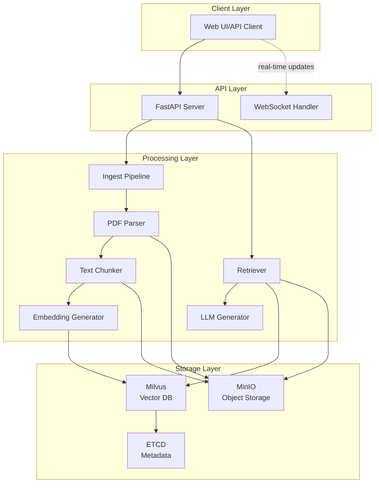

# RAG Pipeline - Mimari Dokümantasyon

## 🎯 Proje Özeti

Bu proje, PDF dosyalarından bilgi çıkararak kullanıcıların doğal dilde sordukları sorulara kaynak göstererek cevap veren bir **Retrieval-Augmented Generation (RAG)** sistemidir. Sistem tamamen Docker üzerinde çalışacak şekilde tasarlanmıştır ve mikroservis mimarisine sahiptir.

### Temel Özellikler
- 📄 PDF dosyalarının otomatik işlenmesi ve indekslenmesi
- 🔍 Semantik arama ile ilgili içeriğin bulunması
- 💬 Kaynak göstererek doğal dilde cevap üretimi
- 🚀 Yüksek performanslı vektör araması (Milvus)
- 📦 Ölçeklenebilir object storage (MinIO)
- 🔧 RESTful API ve WebSocket desteği

## 🏗️ Sistem Mimarisi

### Teknoloji Stack'i

| Bileşen | Teknoloji | Amaç |
|---------|-----------|------|
| Object Storage | MinIO | PDF ve chunk dosyalarının saklanması |
| Vector Database | Milvus | Embedding vektörlerinin saklanması ve aranması |
| Metadata Store | ETCD | Milvus metadata yönetimi |
| PDF Parser | PyMuPDF | PDF dosyalarından metin çıkarma |
| Text Splitter | LangChain | Metni anlamlı parçalara bölme |
| Embedding Model | BGE-M3 | Metin → vektör dönüşümü |
| Reranker | BGE-Reranker-v2-m3 | Arama sonuçlarını yeniden sıralama |
| LLM | OpenAI/Ollama | Cevap üretimi |
| Backend | FastAPI | REST API servisi |
| Containerization | Docker | Tüm servislerin orkestrayonu |

### Mimari Diyagram



## 📊 Veri Akış Diyagramı

### 1. PDF İndeksleme Akışı (Ingest)

```
PDF Dosyası 
    ↓
[1. Upload] → MinIO (raw-pdfs bucket)
    ↓
[2. Parse] → Metin çıkarma + metadata
    ↓
[3. Chunk] → Token bazlı bölme (512 token, 50 overlap)
    ↓
[4. Embed] → BGE-M3 ile vektör üretimi (1024 dimension)
    ↓
[5. Index] → Milvus'a vektör + metadata kayıt
    ↓
[6. Store] → MinIO'ya chunk metinleri kayıt (chunks bucket)
```

### 2. Soru-Cevap Akışı (Query)

```
Kullanıcı Sorusu
    ↓
[1. Embed] → Soru vektöre dönüştürülür
    ↓
[2. Search] → Milvus'ta en yakın K=10 chunk bulunur
    ↓
[3. Rerank] → BGE-Reranker ile yeniden sıralama (top 5)
    ↓
[4. Retrieve] → MinIO'dan chunk metinleri çekilir
    ↓
[5. Context] → Prompt hazırlanır (soru + context + instructions)
    ↓
[6. Generate] → LLM ile cevap üretimi
    ↓
[7. Response] → JSON formatında kaynaklı cevap
```

## 📁 Proje Dosya Yapısı

```
onedocs-rag/
├── docker-compose.yml          # Docker servisleri orkestrasyonu
├── Dockerfile                  # FastAPI uygulaması için container
├── .env                       # Ortam değişkenleri (gitignore)
├── .env.example              # Ortam değişkenleri şablonu
├── requirements.txt          # Python bağımlılıkları
├── Claude.md                # Bu dokümantasyon
│
├── app/                     # Ana uygulama kodu
│   ├── __init__.py
│   ├── config.py           # Konfigürasyon yönetimi
│   ├── storage.py          # MinIO işlemleri
│   ├── parse.py            # PDF parsing fonksiyonları
│   ├── chunk.py            # Metin bölme fonksiyonları
│   ├── embed.py            # Embedding üretimi
│   ├── index.py            # Milvus indeksleme
│   ├── retrieve.py         # Vektör arama ve retrieval
│   ├── generate.py         # LLM cevap üretimi
│   ├── ingest.py           # İndeksleme pipeline orkestrasyonu
│   └── server.py           # FastAPI endpoints
│
├── data/                   # Local veri dizinleri (Docker volumes)
│   ├── minio/             # MinIO storage
│   ├── milvus/            # Milvus vektör veritabanı
│   └── etcd/              # ETCD metadata
│
├── tests/                 # Test dosyaları
│   ├── test_parse.py
│   ├── test_chunk.py
│   ├── test_embed.py
│   └── test_api.py
│
└── scripts/              # Yardımcı scriptler
    ├── setup.sh         # İlk kurulum scripti
    ├── seed_data.py     # Örnek veri yükleme
    └── cleanup.sh       # Temizlik scripti
```

## 🐳 Docker Container Mimarisi

### Container'lar ve İlişkileri

```yaml
Services:
  1. minio (minio/minio:latest)
     - Port: 9000 (API), 9001 (Console)
     - Volume: ./data/minio:/data
     - Buckets: raw-pdfs, chunks
  
  2. etcd (quay.io/coreos/etcd:latest)
     - Port: 2379, 2380
     - Volume: ./data/etcd:/etcd-data
  
  3. milvus (milvusdb/milvus:latest)
     - Port: 19530 (gRPC), 9091 (metrics)
     - Volume: ./data/milvus:/var/lib/milvus
     - Depends on: etcd, minio
  
  4. attu (zilliz/attu:latest)
     - Port: 8000
     - Milvus GUI yönetim arayüzü
  
  5. app (custom FastAPI)
     - Port: 8080
     - Environment: Production
     - Depends on: minio, milvus
```

### Docker Network Yapısı

```
rag-network (bridge)
    ├── minio:9000
    ├── etcd:2379
    ├── milvus:19530
    ├── attu:8000
    └── app:8080
```

## 🚀 Kurulum ve Çalıştırma

### Gereksinimler
- Docker & Docker Compose (v2.0+)
- Python 3.9+ (local development için)
- 8GB+ RAM (önerilen 16GB)
- 20GB+ boş disk alanı

### Adım 1: Repository'yi Klonlama

```bash
git clone https://github.com/yourusername/onedocs-rag.git
cd onedocs-rag
```

### Adım 2: Ortam Değişkenlerini Ayarlama

```bash
cp .env.example .env
# .env dosyasını düzenleyin ve API key'leri ekleyin
```

### Adım 3: Docker Container'ları Başlatma

```bash
# Tüm servisleri başlat
docker-compose up -d

# Log'ları takip et
docker-compose logs -f

# Servis durumlarını kontrol et
docker-compose ps
```

### Adım 4: Servislerin Hazır Olmasını Bekleme

```bash
# Health check (yaklaşık 30-60 saniye)
curl http://localhost:8080/health
```

### Adım 5: İlk PDF'i Yükleme

```bash
# PDF indeksleme
curl -X POST "http://localhost:8080/ingest" \
  -H "Content-Type: multipart/form-data" \
  -F "file=@sample.pdf" \
  -F "metadata={\"source\":\"manual\",\"tags\":[\"test\"]}"
```

### Adım 6: Soru Sorma

```bash
# Query endpoint
curl -X POST "http://localhost:8080/query" \
  -H "Content-Type: application/json" \
  -d '{
    "question": "Bu dokümanda ne anlatılıyor?",
    "top_k": 5,
    "use_reranker": true
  }'
```

## 📡 API Endpoints

### 1. PDF İndeksleme

```http
POST /ingest
Content-Type: multipart/form-data

Parameters:
  - file: PDF dosyası (required)
  - metadata: JSON metadata (optional)
  - chunk_size: Token sayısı (default: 512)
  - chunk_overlap: Overlap token sayısı (default: 50)

Response:
{
  "status": "success",
  "document_id": "doc_123456",
  "chunks_created": 42,
  "processing_time": 3.14
}
```

### 2. Soru-Cevap

```http
POST /query
Content-Type: application/json

Body:
{
  "question": "string",
  "top_k": 5,
  "use_reranker": true,
  "filters": {
    "document_id": "doc_123456",
    "date_range": ["2024-01-01", "2024-12-31"]
  }
}

Response:
{
  "answer": "string",
  "sources": [
    {
      "chunk_id": "chunk_789",
      "document_id": "doc_123456",
      "page": 3,
      "score": 0.92,
      "text": "relevant chunk text..."
    }
  ],
  "metadata": {
    "model": "gpt-4",
    "processing_time": 1.23,
    "tokens_used": 450
  }
}
```

### 3. Doküman Listeleme

```http
GET /documents
Query Parameters:
  - page: int (default: 1)
  - limit: int (default: 20)
  - sort: string (date|name|size)

Response:
{
  "documents": [...],
  "total": 100,
  "page": 1,
  "pages": 5
}
```

### 4. Doküman Silme

```http
DELETE /documents/{document_id}

Response:
{
  "status": "success",
  "deleted_chunks": 42
}
```

### 5. Health Check

```http
GET /health

Response:
{
  "status": "healthy",
  "services": {
    "minio": "connected",
    "milvus": "connected",
    "embedding_model": "loaded"
  },
  "version": "1.0.0"
}
```

### 6. WebSocket - Gerçek Zamanlı İşlem Takibi

```javascript
// WebSocket bağlantısı
const ws = new WebSocket('ws://localhost:8080/ws');

ws.onmessage = (event) => {
  const data = JSON.parse(event.data);
  console.log('Progress:', data);
  // {
  //   "type": "progress",
  //   "stage": "parsing",
  //   "progress": 45,
  //   "message": "Processing page 12 of 30"
  // }
};
```

## 🔧 Konfigürasyon Detayları

### Ortam Değişkenleri (.env)

```bash
# MinIO Configuration
MINIO_ENDPOINT=localhost:9000
MINIO_ACCESS_KEY=minioadmin
MINIO_SECRET_KEY=minioadmin
MINIO_SECURE=false
MINIO_BUCKET_DOCS=raw-pdfs
MINIO_BUCKET_CHUNKS=chunks

# Milvus Configuration
MILVUS_HOST=localhost
MILVUS_PORT=19530
MILVUS_COLLECTION=rag_chunks
MILVUS_INDEX_TYPE=IVF_FLAT
MILVUS_METRIC_TYPE=IP
MILVUS_NLIST=128

# Embedding Configuration
EMBEDDING_MODEL=BAAI/bge-m3
EMBEDDING_BATCH_SIZE=32
EMBEDDING_DEVICE=cuda  # veya cpu
RERANKER_MODEL=BAAI/bge-reranker-v2-m3

# LLM Configuration
LLM_PROVIDER=openai  # openai veya ollama
OPENAI_API_KEY=sk-...
OPENAI_MODEL=gpt-4
OLLAMA_HOST=http://localhost:11434
OLLAMA_MODEL=qwen2.5:7b-instruct

# Chunking Configuration
CHUNK_SIZE=512
CHUNK_OVERLAP=50
CHUNK_METHOD=token  # token veya character

# API Configuration
API_HOST=0.0.0.0
API_PORT=8080
API_WORKERS=4
CORS_ORIGINS=["http://localhost:3000"]

# Logging
LOG_LEVEL=INFO
LOG_FILE=/app/logs/app.log
```

### Milvus Collection Schema

```python
{
  "collection_name": "rag_chunks",
  "fields": [
    {
      "name": "id",
      "type": "VARCHAR",
      "max_length": 100,
      "is_primary": True
    },
    {
      "name": "embedding",
      "type": "FLOAT_VECTOR",
      "dim": 1024
    },
    {
      "name": "document_id",
      "type": "VARCHAR",
      "max_length": 100
    },
    {
      "name": "chunk_index",
      "type": "INT64"
    },
    {
      "name": "page_number",
      "type": "INT64"
    },
    {
      "name": "text_hash",
      "type": "VARCHAR",
      "max_length": 64
    },
    {
      "name": "created_at",
      "type": "INT64"
    }
  ],
  "index_params": {
    "metric_type": "IP",
    "index_type": "IVF_FLAT",
    "params": {"nlist": 128}
  }
}
```

## 📊 Pipeline Detayları

### 1. PDF Parsing (parse.py)

```python
Fonksiyonlar:
- extract_text_from_pdf(file_path) -> List[PageContent]
  - PyMuPDF kullanarak metin çıkarma
  - Her sayfa için metadata oluşturma
  - Görüntü ve tablo tespiti
  
- extract_metadata(file_path) -> DocumentMetadata
  - Başlık, yazar, oluşturma tarihi
  - Sayfa sayısı, dosya boyutu
  - Dil tespiti
```

### 2. Text Chunking (chunk.py)

```python
Stratejiler:
1. Token-based chunking
   - tiktoken encoder kullanımı
   - Overlap ile context korunması
   - Cümle sınırlarına dikkat

2. Semantic chunking
   - Paragraf ve bölüm tespiti
   - Anlamsal bütünlük korunması
   
3. Hybrid approach
   - Token limiti + semantic boundaries
   - Optimal chunk boyutu
```

### 3. Embedding Generation (embed.py)

```python
Özellikler:
- Batch processing (32 chunks/batch)
- GPU acceleration (if available)
- Normalization
- Dimension reduction (opsiyonel)
- Cache mekanizması
```

### 4. Vector Indexing (index.py)

```python
İndeks Türleri:
1. IVF_FLAT
   - Orta ölçekli veri için optimal
   - nlist=128 clusters
   
2. HNSW
   - Büyük ölçekli veri için
   - M=16, ef_construction=200
   
3. AUTOINDEX
   - Otomatik optimizasyon
```

### 5. Retrieval & Reranking (retrieve.py)

```python
Arama Stratejisi:
1. Initial retrieval
   - Top-K=10 semantic search
   - Cosine similarity
   
2. Reranking
   - Cross-encoder model
   - Score normalization
   - Top-5 selection
   
3. Diversity
   - MMR (Maximal Marginal Relevance)
   - Duplicate removal
```

### 6. Response Generation (generate.py)

```python
Prompt Engineering:
- System prompt: RAG context instructions
- Context formatting: Numbered sources
- Citation requirements
- Hallucination prevention
- Token management
```

## 🧪 Test Senaryoları

### Unit Tests

```bash
# Tüm testleri çalıştır
pytest tests/

# Belirli bir modülü test et
pytest tests/test_chunk.py -v

# Coverage raporu
pytest --cov=app tests/
```

### Integration Tests

```python
1. End-to-end PDF processing
2. Vector search accuracy
3. API response validation
4. Concurrent request handling
5. Error recovery
```

### Performance Tests

```bash
# Locust ile yük testi
locust -f tests/locustfile.py \
  --host=http://localhost:8080 \
  --users=100 \
  --spawn-rate=10
```

## 📈 Monitoring & Observability

### Metrics

```yaml
Prometheus Metrics:
- pdf_processing_duration_seconds
- embedding_generation_duration_seconds
- query_latency_seconds
- milvus_search_duration_seconds
- llm_generation_tokens_total
```

### Logging

```python
Structured Logging:
{
  "timestamp": "2024-01-01T12:00:00Z",
  "level": "INFO",
  "service": "ingest",
  "document_id": "doc_123",
  "stage": "chunking",
  "chunks_created": 42,
  "duration_ms": 1234
}
```

### Dashboards

- **Grafana Dashboard**: System metrics, API latency, throughput
- **Milvus Attu**: Vector database management
- **MinIO Console**: Object storage monitoring

## 🚦 Production Deployment

### Scaling Considerations

```yaml
1. Horizontal Scaling:
   - FastAPI workers: 4-8 per container
   - Load balancer: Nginx/Traefik
   - Session affinity for WebSocket

2. Database Scaling:
   - Milvus cluster mode
   - Read replicas
   - Partition by date/source

3. Caching:
   - Redis for embedding cache
   - CDN for static assets
   - Query result caching
```

### Security Best Practices

```yaml
1. Authentication:
   - JWT tokens
   - API key management
   - Rate limiting

2. Data Security:
   - Encryption at rest (MinIO)
   - TLS for all connections
   - Secrets management (Vault)

3. Input Validation:
   - File type verification
   - Size limits
   - Content scanning
```

### Backup & Recovery

```bash
# Milvus backup
docker exec milvus /milvus/bin/save --collection rag_chunks

# MinIO sync
mc mirror minio/raw-pdfs s3/backup-bucket/

# Database export
docker exec milvus /milvus/bin/export --path /backup/
```

## 🔍 Troubleshooting

### Common Issues

1. **Milvus Connection Error**
   ```bash
   # Check Milvus status
   docker-compose logs milvus
   # Restart service
   docker-compose restart milvus
   ```

2. **Embedding Model Loading**
   ```bash
   # Clear model cache
   rm -rf ~/.cache/huggingface/
   # Re-download model
   python -c "from sentence_transformers import SentenceTransformer; SentenceTransformer('BAAI/bge-m3')"
   ```

3. **Memory Issues**
   ```yaml
   # docker-compose.yml içinde memory limits
   services:
     app:
       mem_limit: 4g
       memswap_limit: 4g
   ```

## 🎯 Kullanım Örnekleri

### Örnek 1: Teknik Doküman İndeksleme

```python
import requests

# PDF yükleme
with open("technical_manual.pdf", "rb") as f:
    response = requests.post(
        "http://localhost:8080/ingest",
        files={"file": f},
        data={
            "metadata": json.dumps({
                "category": "technical",
                "version": "2.0",
                "language": "tr"
            })
        }
    )

# Soru sorma
query = {
    "question": "Sistemin kurulum gereksinimleri nelerdir?",
    "filters": {"category": "technical"},
    "top_k": 3
}

response = requests.post(
    "http://localhost:8080/query",
    json=query
)
```

### Örnek 2: Batch Processing

```python
import asyncio
import aiohttp

async def process_pdf(session, file_path):
    async with session.post(
        "http://localhost:8080/ingest",
        data={"file": open(file_path, "rb")}
    ) as response:
        return await response.json()

async def batch_ingest(pdf_files):
    async with aiohttp.ClientSession() as session:
        tasks = [process_pdf(session, f) for f in pdf_files]
        return await asyncio.gather(*tasks)

# Çoklu PDF işleme
pdf_list = ["doc1.pdf", "doc2.pdf", "doc3.pdf"]
results = asyncio.run(batch_ingest(pdf_list))
```

### Örnek 3: WebSocket ile Gerçek Zamanlı İzleme

```javascript
// Frontend JavaScript
class RAGClient {
    constructor(apiUrl) {
        this.apiUrl = apiUrl;
        this.ws = null;
    }
    
    connectWebSocket() {
        this.ws = new WebSocket(`${this.apiUrl}/ws`);
        
        this.ws.onopen = () => {
            console.log("WebSocket connected");
        };
        
        this.ws.onmessage = (event) => {
            const data = JSON.parse(event.data);
            this.handleProgress(data);
        };
    }
    
    handleProgress(data) {
        switch(data.type) {
            case 'parsing':
                console.log(`Parsing: ${data.progress}%`);
                break;
            case 'chunking':
                console.log(`Chunking: ${data.chunks_created} chunks`);
                break;
            case 'embedding':
                console.log(`Embedding: ${data.progress}%`);
                break;
            case 'complete':
                console.log(`Processing complete: ${data.document_id}`);
                break;
        }
    }
    
    async uploadPDF(file) {
        const formData = new FormData();
        formData.append('file', file);
        
        const response = await fetch(`${this.apiUrl}/ingest`, {
            method: 'POST',
            body: formData
        });
        
        return response.json();
    }
}
```

## 🛠️ Development Workflow

### Local Development

```bash
# Virtual environment oluşturma
python -m venv venv
source venv/bin/activate  # Linux/Mac
# veya
venv\Scripts\activate  # Windows

# Dependencies kurulumu
pip install -r requirements.txt

# Development server
uvicorn app.server:app --reload --port 8080

# Code formatting
black app/
isort app/

# Type checking
mypy app/

# Linting
flake8 app/
```

### Git Workflow

```bash
# Feature branch
git checkout -b feature/new-chunking-strategy

# Commit convention
git commit -m "feat: add semantic chunking support"
git commit -m "fix: resolve embedding dimension mismatch"
git commit -m "docs: update API documentation"

# Pull request
git push origin feature/new-chunking-strategy
```

## 📚 Kaynaklar

### Dokümantasyon
- [Milvus Docs](https://milvus.io/docs)
- [MinIO Docs](https://docs.min.io)
- [FastAPI Docs](https://fastapi.tiangolo.com)
- [BGE Models](https://huggingface.co/BAAI)

### Papers & Research
- "Retrieval-Augmented Generation for Knowledge-Intensive NLP Tasks" (Lewis et al., 2020)
- "Dense Passage Retrieval for Open-Domain Question Answering" (Karpukhin et al., 2020)

### Community
- [GitHub Issues](https://github.com/yourusername/onedocs-rag/issues)
- [Discord Server](#)

## 📄 Lisans

MIT License - Detaylar için [LICENSE](LICENSE) dosyasına bakın.

---

**Version:** 1.0.0  
**Last Updated:** 2024-12-04  
**Maintainer:** AI Team