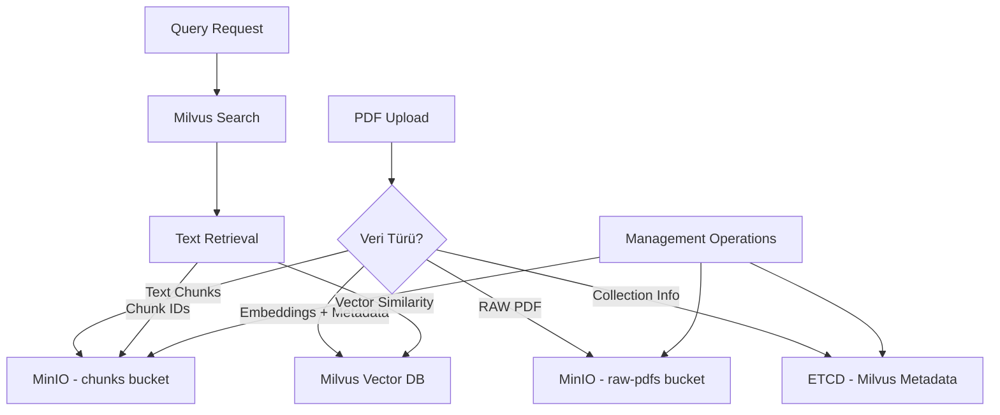

# RAG Veri Depolama ve Erişim Akışı

Bu doküman, RAG sistemindeki verilerin **ne zaman, nereye** kaydedildiğini, **nereden çekildiğini** ve **nasıl kullanıldığını** detaylandırır.

## 🗂️ Veri Depolama Mimarisi



---

## 📊 Veri Depolama Tablosu

| Veri Türü | Depolama Yeri | Ne Zaman Yazılır | Ne Zaman Okunur | Boyut |
|-----------|---------------|------------------|-----------------|--------|
| **RAW PDF Files** | MinIO (raw-pdfs) | PDF Upload | ❌ Hiç okunmuyor | MB boyutlarında |
| **Text Chunks** | MinIO (chunks) | ❌ Development only | ❌ Production'da kullanılmıyor | KB boyutlarında |
| **Vector Embeddings** | Milvus | PDF Processing | Her Query | 1536x4 = 6KB/chunk |
| **Chunk Metadata** | Milvus | PDF Processing | Her Query | Satır başına ~1KB |
| **Collection Schema** | ETCD | Collection Creation | Service Start | KB boyutlarında |

---

# 🔄 **1. INGESTION (PDF Yükleme) - Veri YAZMA**

## Production Server Veri Akışı

### 📄 **Adım 1: PDF Upload (MinIO'ya Kaydedilmez)**

```python
# production_server.py:114-120
pdf_data = await file.read()
file_hash = hashlib.md5(pdf_data).hexdigest()
document_id = f"doc_{file_hash[:16]}"
```

**❌ KRITIK**: Production server **PDF'i MinIO'ya kaydetmez!**  
**Neden**: Memory-only processing, hız odaklı

---

### 📝 **Adım 2: Text Extraction (Memory Only)**

```python
# production_server.py:122-128
from app.parse import PDFParser
parser = PDFParser()
pages, metadata = parser.extract_text_from_pdf(pdf_data)
document_title = metadata.title or file.filename.replace('.pdf', '')
```

**Veri Türü**: Raw text pages  
**Depolama**: ❌ Hiçbir yere kaydedilmez, sadece memory'de  
**Ömür**: Processing süresince (5-15 saniye)

---

### ✂️ **Adım 3: Chunking (Memory Only)**

```python
# production_server.py:131-150
chunks = []
for i, page in enumerate(pages):
    text = page.text.strip()
    if len(text) > 100:  # Skip very short pages
        chunk_id = f"chunk_{document_id}_{i:04d}_{hash(text[:100]) & 0xffff:04x}"
        chunk = SimpleChunk(
            chunk_id=chunk_id,
            text=text,
            page_number=page.page_number
        )
        chunks.append(chunk)
```

**Veri Türü**: Text chunks  
**Depolama**: ❌ Hiçbir yere kaydedilmez, sadece memory'de  
**Chunk ID Format**: `chunk_doc_123456_0001_a1b2`

---

### 🔢 **Adım 4: Embedding Generation (OpenAI API → Memory)**

```python
# production_server.py:194-214
for i, chunk in enumerate(chunks):
    # Generate embedding
    response = client.embeddings.create(
        model='text-embedding-3-small',
        input=chunk.text
    )
    
    # Collect data
    chunk_ids.append(chunk.chunk_id)
    document_ids.append(document_id)  
    document_titles.append(document_title)
    texts.append(chunk.text)
    embeddings.append(response.data[0].embedding)  # 1536-dim float array
    page_nums.append(chunk.page_number)
    chunk_indices.append(i)
    created_ats.append(current_time)
    file_hashes.append(file_hash)
```

**API Çağrısı**: OpenAI Embeddings API  
**Model**: `text-embedding-3-small`  
**Output**: 1536 boyutlu float vector  
**Depolama**: Memory arrays (Milvus insert için hazırlanır)

---

### 💾 **Adım 5: MILVUS INSERT - Ana Veri Depolama**

```python
# production_server.py:216-225
data = [
    chunk_ids,           # VARCHAR(100) - Primary Key
    document_ids,        # VARCHAR(100) - Document Reference  
    document_titles,     # VARCHAR(100) - Human readable title
    texts,              # VARCHAR(65535) - Full chunk text
    embeddings,         # FLOAT_VECTOR(1536) - OpenAI vectors
    page_nums,          # INT64 - Source page number
    chunk_indices,      # INT64 - Chunk order in document
    created_ats,        # VARCHAR(100) - ISO timestamp
    file_hashes        # VARCHAR(100) - Original PDF hash
]

insert_result = collection.insert(data)
collection.load()  # CRITICAL: Index refresh for immediate search
```

**Hedef**: Milvus Vector Database (`rag_production_v1` collection)  
**Schema**: 9 field'lı struktur  
**İndeksleme**: COSINE similarity ile AUTOINDEX  
**Anında Kullanılabilir**: `collection.load()` sayesinde

---

### 🗄️ **ETCD - Otomatik Metadata Yazımı**

```python
# Milvus otomatik olarak collection schema'yı ETCD'ye kaydeder
{
  "collection_name": "rag_production_v1",
  "schema": {
    "fields": [
      {"name": "id", "type": "VARCHAR", "max_length": 100, "is_primary": true},
      {"name": "embedding", "type": "FLOAT_VECTOR", "dim": 1536},
      {"name": "document_id", "type": "VARCHAR", "max_length": 100},
      // ... diğer field'lar
    ]
  },
  "index_info": {
    "field_name": "embedding", 
    "metric_type": "COSINE",
    "index_type": "AUTOINDEX"
  }
}
```

**Ne Zaman**: Collection ilk oluşturulduğunda  
**Kim Yazar**: Milvus servisi otomatik  
**İçerik**: Collection schema, index tanımları, partition bilgileri  
**Okunma**: Milvus service restart'ında

---

# 🔍 **2. QUERY (Soru-Cevap) - Veri OKUMA**

## Query Pipeline Veri Erişimi

### 🔢 **Adım 1: Query Embedding Generation**

```python
# production_server.py:274-278
query_response = client.embeddings.create(
    model='text-embedding-3-small',
    input=request.question
)
query_embedding = query_response.data[0].embedding
```

**API Çağrısı**: OpenAI Embeddings API (aynı model)  
**Input**: User question string  
**Output**: 1536-dim query vector  
**Depolama**: Memory (geçici)

---

### 🎯 **Adım 2: MILVUS VECTOR SEARCH - Ana Veri Okuma**

```python  
# production_server.py:285-293
search_results = collection.search(
    [query_embedding],           # Query vector
    'embedding',                 # Vector field name
    {'metric_type': 'COSINE'},   # Similarity function
    limit=request.top_k,         # Kaç sonuç isteniyor
    expr=expr,                   # Filter expressions (opsiyonel)
    output_fields=[              # Hangi field'lar çekilecek
        'document_id', 'document_title', 'text', 
        'page_num', 'created_at'
    ]
)
```

**Okuma Yeri**: Milvus Vector Database  
**İşlem Türü**: Vector similarity search (COSINE)  
**Index Kullanımı**: AUTOINDEX ile hızlı arama  
**Returned Data**: Top-K en yakın chunk'lar + metadata  
**Hız**: 10-50ms (index sayesinde çok hızlı)

### 📊 **Milvus Search Sonuç Yapısı**

```python
# search_results[0] formatı:
[
    {
        "score": 0.628,                    # Similarity score
        "entity": {
            "document_id": "doc_c5962af5dd592a8f",
            "document_title": "2765", 
            "text": "NÜKLEER TESİSLERE LİSANS...",  # Full chunk text
            "page_num": 1,
            "created_at": "2025-09-05T12:49:12.489911"
        }
    },
    {
        "score": 0.577,
        "entity": {...}
    }
]
```

**Kritik**: Milvus **hem vector search hem de text retrieval** yapıyor!  
**MinIO'ya erişim yok**: Tüm gerekli data Milvus'ta mevcut

---

### 🧠 **Adım 3: Context Assembly + LLM Generation**

```python
# production_server.py:304-326
context_parts = []
for i, result in enumerate(search_results[0]):
    text = result.entity.get('text')           # Milvus'tan çekilen full text
    page_num = result.entity.get('page_num')   # Page reference
    
    sources.append({
        "rank": i + 1,
        "score": round(score, 3),
        "document_id": doc_id,
        "document_title": doc_title,
        "page_number": page_num,
        "text_preview": text[:200] + "...",    # Preview for response
        "created_at": created_at
    })
    
    context_parts.append(f"[Kaynak {i+1} - Sayfa {page_num}]: {text}")

context = "\n\n".join(context_parts)  # Full context for LLM
```

**Veri Kaynağı**: Milvus search sonuçları  
**İşlem**: String concatenation  
**Output**: LLM için formatted context + user için source list

---

# 🔧 **3. MANAGEMENT OPERATIONS**

## Document Listing

```python
# production_server.py:381-384
results = collection.query(
    expr="chunk_index == 0",  # Only first chunk of each document
    output_fields=['document_id', 'document_title', 'created_at', 'file_hash']
)
```

**Okuma**: Milvus'tan document metadata  
**Filtre**: İlk chunk'lar (duplicate prevention)  
**Kullanım**: Document management UI'ı için

## Document Deletion

```python  
# production_server.py:422-432
chunks = collection.query(
    expr=f'document_id == "{document_id}"',
    output_fields=['id']
)

ids_to_delete = [chunk['id'] for chunk in chunks]
collection.delete(f"id in {ids_to_delete}")
```

**İşlem**: Milvus'tan document chunks'larını silme  
**Cascade Delete**: Document ile ilgili tüm chunk'lar silinir

---

# 🏗️ **4. ETCD KULLANIM DETAYLARI**

## ETCD Ne Zaman Kullanılır?

### **YAZMA (Milvus tarafından otomatik):**

1. **Collection Creation**
   ```python
   # İlk kez collection oluşturulduğunda
   collection = Collection(name="rag_production_v1", schema=schema)
   # ETCD'ye schema, index config yazılır
   ```

2. **Index Creation/Modification**
   ```python
   collection.create_index(field_name="embedding", index_params=params)
   # ETCD'ye index metadata yazılır
   ```

3. **Partition Management**
   ```python
   collection.create_partition("partition_2024")
   # ETCD'ye partition bilgileri yazılır  
   ```

### **OKUMA (Milvus tarafından otomatik):**

1. **Service Startup**
   - Milvus başlatıldığında collection'ları ETCD'den okur
   - Schema ve index bilgilerini restore eder
   
2. **Connection Management** 
   - Collection list, schema definitions
   - Index parametreleri

3. **Cluster Coordination** (eğer cluster mode)
   - Node assignment, load balancing metadata

---

# 💾 **5. MINIO KULLANIM DETAYLARI**

## Development vs Production Farkları

### **Development Server (app/server.py):**

```python
# app/storage.py kullanır
storage.upload_pdf(file_data, filename, metadata)      # MinIO'ya PDF kaydeder
storage.save_chunks_batch(document_id, chunks)         # MinIO'ya chunks kaydeder
```

**MinIO Buckets:**
- `raw-pdfs`: PDF files 
- `chunks`: JSON chunk files

### **Production Server (production_server.py):**

```python
# MinIO hiç kullanılmaz!
# Sadece memory processing + direct Milvus insert
pdf_data = await file.read()  # Memory'de tutuluyor
# ... processing ...
collection.insert(data)       # Direkt Milvus'a
```

**Neden MinIO yok?**
- **Performance**: Memory işleme daha hızlı
- **Simplicity**: Tek data store (sadece Milvus)
- **Cost**: Storage maliyeti düşük

---

# 🎯 **6. PERFORMANS VE OPTİMİZASYON**

## Veri Erişim Hızları

| İşlem | Depolama | Tipik Süre | Optimizasyon |
|-------|----------|------------|--------------|
| **PDF Upload** | Memory | 10-100ms | Streaming upload |
| **Text Extraction** | Memory | 1-3 saniye | PyMuPDF parallel |
| **Embedding API** | OpenAI | 200-500ms/chunk | Batch processing |
| **Milvus Insert** | SSD/RAM | 100-500ms | Batch insert |
| **Vector Search** | RAM Index | 10-50ms | AUTOINDEX |
| **Text Retrieval** | Milvus | 5ms | Same query |

## Memory Management

```python
# Critical memory management in production
pdf_data = await file.read()        # ~1-50MB memory
pages = parser.extract(pdf_data)    # ~10-100MB memory  
chunks = create_chunks(pages)       # ~5-50MB memory
embeddings = generate_embeddings()  # ~1MB per 100 chunks
collection.insert(data)             # Data Milvus'a transfer edilir
# Memory otomatically released by Python GC
```

---

# 🔍 **7. DEBUGGING VE MONİTORİNG**

## Veri Durumu Kontrolleri

### **Milvus Collection Status:**
```python
collection.num_entities          # Toplam chunk sayısı
collection.is_loaded            # Index memory'de mi?
collection.describe()           # Schema bilgileri
```

### **ETCD Health Check:**
```bash
etcdctl endpoint health
etcdctl get --prefix /milvus/
```

### **MinIO Status (Development):**
```python
client.list_objects(bucket_name)     # Object sayısı
client.bucket_exists(bucket_name)    # Bucket varlığı
```

## Log Monitoring Points

```python
# Her veri işlemi loglanır
logger.info(f"Created {len(chunks)} chunks")                          # Chunking
logger.info(f"Processed {i + 1}/{len(chunks)} chunks")               # Embedding
logger.info("Inserting to production Milvus...")                     # Milvus Insert
logger.info(f"Successfully ingested {len(chunks)} chunks")           # Success
logger.info(f"Query completed in {processing_time:.2f}s")            # Query performance
```

---

# 🎯 **ÖZET: Veri Akış Tablosu**

| Pipeline Stage | Veri Input | MinIO | Milvus | ETCD | Memory |
|---------------|------------|-------|--------|------|--------|
| **PDF Upload** | PDF bytes | ❌ | ❌ | ❌ | ✅ |
| **Text Parse** | PDF bytes | ❌ | ❌ | ❌ | ✅ |
| **Chunking** | Text pages | ❌ | ❌ | ❌ | ✅ |
| **Embedding** | Text chunks | ❌ | ❌ | ❌ | ✅ |
| **Insert** | Vectors+Metadata | ❌ | ✅ Write | ✅ Auto | ❌ |
| **Query Search** | Query vector | ❌ | ✅ Read | ✅ Auto | ✅ |
| **Response** | Search results | ❌ | ❌ | ❌ | ✅ |

**Ana Depolama**: Milvus Vector Database  
**Yardımcı**: ETCD (otomatik metadata)  
**Kullanılmayan**: MinIO (production'da)

Bu sistemde **Milvus tek source of truth** görevi görür ve hem vector search hem de text storage ihtiyaçlarını karşılar.