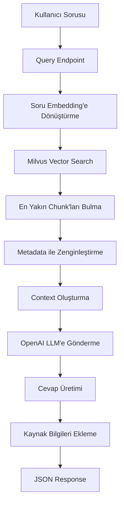

# RAG Pipeline Veri Akış Detayları

Bu doküman, kullanıcının bir soru sormasından cevap almasına kadar geçen süredeki veri akışını adım adım açıklar. Ayrıca anlık belge yükleme (ingestion) sürecini de detaylandırır.

## 🔄 Genel Pipeline Akışı



## 1️⃣ Kullanıcı Sorusu Gelişi

### HTTP Request
```http
POST /query HTTP/1.1
Content-Type: application/json

{
    "question": "Harcırahların ödeme şartları nelerdir?",
    "top_k": 3,
    "document_id": null
}
```

### Kod Yolu: `production_server.py:255`
```python
@app.post("/query", response_model=QueryResponse)
async def query_documents(request: QueryRequest):
    start_time = datetime.datetime.now()
    logger.info(f"Query: {request.question}")
```

---

## 2️⃣ Soru Embedding'e Dönüştürme

### OpenAI API Çağrısı
```python
# production_server.py:274-278
query_response = client.embeddings.create(
    model='text-embedding-3-small',
    input=request.question
)
query_embedding = query_response.data[0].embedding
```

### Veri Dönüşümü
- **Giriş**: `"Harcırahların ödeme şartları nelerdir?"` (String)
- **Çıkış**: `[0.123, -0.456, 0.789, ...]` (1536 boyutlu float array)
- **API Süresi**: ~200-500ms

---

## 3️⃣ Milvus Vector Search

### Veritabanı Sorgusu
```python
# production_server.py:286-293
search_results = collection.search(
    [query_embedding],           # Query vector
    'embedding',                 # Field adı
    {'metric_type': 'COSINE'},   # Similarity metric
    limit=request.top_k,         # Kaç sonuç
    expr=expr,                   # Filtreler (opsiyonel)
    output_fields=['document_id', 'document_title', 'text', 'page_num', 'created_at']
)
```

### Milvus'ta Ne Oluyor?
1. **Index Kullanımı**: IVF_FLAT index ile hızlı arama
2. **Cosine Similarity**: Query vector ile tüm chunk vectorleri karşılaştırılır
3. **Top-K Selection**: En yüksek similarity score'lu K adet chunk seçilir
4. **Metadata Retrieval**: Seçilen chunk'lar için metadata getirilir

### Örnek Milvus Sonucu
```json
[
    {
        "score": 0.483,
        "entity": {
            "document_id": "doc_06054c7f7733730e",
            "document_title": "HARCIRAH TÜZÜĞÜ",
            "text": "Posta gezici personeline, tren, vapur...",
            "page_num": 1,
            "created_at": "2025-09-05T11:43:29.597080"
        }
    },
    {
        "score": 0.458,
        "entity": {...}
    }
]
```

---

## 4️⃣ Context Assembly (Bağlam Oluşturma)

### Sources Array Hazırlama
```python
# production_server.py:304-326
sources = []
context_parts = []

for i, result in enumerate(search_results[0]):
    score = result.score
    doc_id = result.entity.get('document_id')
    text = result.entity.get('text')
    
    sources.append({
        "rank": i + 1,
        "score": round(score, 3),
        "document_id": doc_id,
        "text_preview": text[:200] + "...",
        # ... diğer metadata
    })
    
    context_parts.append(f"[Kaynak {i+1} - Sayfa {page_num}]: {text}")
```

### Context String Oluşturma
```python
context = "\n\n".join(context_parts)
```

### Örnek Context
```
[Kaynak 1 - Sayfa 1]: Posta gezici personeline, tren, vapur, karayolları ve havayolları araçlarında gezici olarak posta götürüp getiren personele ve bunlara eşlik ettirilen taşıcılara, çıkış yerlerinden vasıtaların hareket saatinden itibaren...

[Kaynak 2 - Sayfa 1]: Gezici personelin son varış yerlerinde dönüş servisine başlamak üzere beklemekle geçirdikleri süre, harcırah alma süresine dahil edilir...
```

---

## 5️⃣ OpenAI LLM Çağrısı

### Chat Completion Request
```python
# production_server.py:330-351
chat_response = client.chat.completions.create(
    model='gpt-4o-mini',
    messages=[
        {
            "role": "system", 
            "content": """Sen bir RAG asistanısın. 
            Verilen kaynak belgelerden faydalanarak cevaplıyorsun.
            Cevabını verirken kaynak numaralarını belirt."""
        },
        {
            "role": "user",
            "content": f"""Kaynak Belgeler:
{context}

Soru: {request.question}

Lütfen bu soruya kaynak belgelere dayanarak cevap ver."""
        }
    ],
    max_tokens=500
)
```

### LLM Processing
1. **System Prompt**: RAG davranış talimatları
2. **Context Injection**: Bulunan chunk'lar prompt'a eklenir
3. **Question**: Kullanıcının orijinal sorusu
4. **Generation**: GPT-4o-mini model cevap üretir
5. **Citation**: Model otomatik olarak `[Kaynak X]` referansları ekler

---

## 6️⃣ Response Assembly

### Final Response Oluşturma
```python
# production_server.py:358-363
return QueryResponse(
    answer=answer,                    # LLM'den gelen cevap
    sources=sources,                  # Kaynak bilgileri array'i
    processing_time=processing_time,  # Toplam süre
    model_used="gpt-4o-mini"         # Kullanılan model
)
```

### Örnek Final JSON Response
```json
{
    "answer": "Harcırahların ödeme şartları aşağıdaki gibidir:\n\n1. Posta gezici personeline, tren, vapur, karayolları ve havayolları araçlarında gezici olarak posta götürüp getiren personele... [Kaynak 1] [Kaynak 2]",
    "sources": [
        {
            "rank": 1,
            "score": 0.483,
            "document_id": "doc_06054c7f7733730e",
            "document_title": "HARCIRAH TÜZÜĞÜ",
            "page_number": 1,
            "text_preview": "POSTA GEZİCİ PERSONELİNE VERİLECEK\nHARCIRAH TÜZÜĞÜ...",
            "created_at": "2025-09-05T11:43:29.597080"
        }
    ],
    "processing_time": 4.558254,
    "model_used": "gpt-4o-mini"
}
```

---

## ⚡ Performans Metrikleri

### Tipik İşlem Süreleri
| Adım | Süre | Açıklama |
|------|------|----------|
| **Embedding Generation** | 200-500ms | OpenAI API call |
| **Vector Search** | 10-50ms | Milvus index search |
| **Context Assembly** | 5-10ms | Python string operations |
| **LLM Generation** | 2-5 saniye | GPT-4o-mini response |
| **Response Assembly** | 1-5ms | JSON serialization |
| **TOPLAM** | **3-6 saniye** | End-to-end |

### Log Örneği
```
INFO:production_server:Query: Harcırahların ödeme şartları nelerdir?
INFO:httpx:HTTP Request: POST https://api.openai.com/v1/embeddings "HTTP/1.1 200 OK"
INFO:httpx:HTTP Request: POST https://api.openai.com/v1/chat/completions "HTTP/1.1 200 OK"  
INFO:production_server:Query completed in 6.06s
```

---

## 🔍 Veri Yapıları Detayı

### QueryRequest (Giriş)
```python
class QueryRequest(BaseModel):
    question: str                           # Kullanıcı sorusu
    top_k: int = Field(default=3)          # Kaç chunk getirileceği
    document_id: Optional[str] = None       # Spesifik doküman filtresi
```

### Milvus Search Result (Ara Data)
```python
{
    "score": float,              # Similarity score (0-1)
    "entity": {
        "document_id": str,      # Doküman ID
        "document_title": str,   # PDF başlığı
        "text": str,            # Chunk tam metni
        "page_num": int,        # Sayfa numarası
        "chunk_index": int,     # Chunk sırası
        "created_at": str       # İndexlenme tarihi
    }
}
```

### QueryResponse (Çıkış)
```python
class QueryResponse(BaseModel):
    answer: str                    # LLM cevabı
    sources: List[Dict]           # Kaynak bilgileri
    processing_time: float        # İşlem süresi
    model_used: str              # Kullanılan LLM
```

---

## 🔧 Hata Durumları

### 1. Embedding API Hatası
```python
# OpenAI API down veya rate limit
except Exception as e:
    raise HTTPException(status_code=500, detail=f"Embedding failed: {str(e)}")
```

### 2. Milvus Bağlantı Hatası
```python
# Milvus service down
except Exception as e:
    raise HTTPException(status_code=503, detail="Vector database unavailable")
```

### 3. Sonuç Bulunamadı
```python
if not search_results[0]:
    return QueryResponse(
        answer="İlgili bilgi bulunamadı.",
        sources=[],
        processing_time=0,
        model_used="gpt-4o-mini"
    )
```

### 4. LLM API Hatası
```python
# OpenAI Chat API hatası
except Exception as e:
    raise HTTPException(status_code=500, detail=f"Answer generation failed: {str(e)}")
```

---

## 📊 Monitoring Noktaları

### Key Metrics
- **Embedding Latency**: OpenAI embedding API süreleri
- **Search Latency**: Milvus vector search süreleri  
- **Generation Latency**: LLM cevap üretim süreleri
- **End-to-End Latency**: Toplam işlem süreleri
- **Hit Rate**: Başarılı sonuç bulma oranı
- **Error Rate**: Hata oranları

### Logging Points
```python
logger.info(f"Query: {request.question}")                    # Query start
logger.info(f"Found {len(chunks)} relevant chunks")         # Search results
logger.info(f"Query completed in {processing_time:.2f}s")   # Query end
```

Bu akış, her kullanıcı sorgusu için tekrarlanır ve sistem performansı bu adımların optimizasyonuna bağlıdır.

---

# 📄 ANLIK BELGE YÜKLEME (INGESTION) SÜRECİ

## 🔄 Ingestion Pipeline Akışı

```mermaid
graph TD
    A[PDF Upload] --> B[/ingest Endpoint]
    B --> C[File Validation]
    C --> D[PDF Hash Check]
    D --> E{Dokuman Var mı?}
    E -->|Evet| F[Already Exists Response]
    E -->|Hayır| G[PDF Parse]
    G --> H[Text Extraction]
    H --> I[Page-by-Page Chunking]
    I --> J[Embedding Generation]
    J --> K[Milvus Insert]
    K --> L[Collection Reload]
    L --> M[Success Response]
    M --> N[Anında Search Hazır!]
```

## 📋 Anlık Yükleme Adımları

### 1️⃣ PDF Upload & Validation

```http
POST /ingest HTTP/1.1
Content-Type: multipart/form-data

file: [PDF Binary Data]
```

**Kod Yolu**: `production_server.py:100-119`

```python
@app.post("/ingest", response_model=IngestResponse)
async def ingest_document(file: UploadFile = File(...)):
    # File type validation
    if not file.filename.lower().endswith('.pdf'):
        raise HTTPException(status_code=400, detail="Only PDF files are supported")
    
    # Read PDF data
    pdf_data = await file.read()
    file_hash = hashlib.md5(pdf_data).hexdigest()
    document_id = f"doc_{file_hash[:16]}"
```

### 2️⃣ Duplicate Detection (Hash-based)

```python
# Check if document already exists
search_existing = collection.query(
    expr=f'document_id == "{document_id}"',
    output_fields=['id'],
    limit=1
)

if search_existing:
    return IngestResponse(
        success=False,
        message="Document already exists in database"
    )
```

**Avantajı**: Aynı PDF'i tekrar işlemekten kaçınır (performans)

### 3️⃣ PDF Parsing & Text Extraction

```python
# 1. PDF Parse using PyMuPDF
from app.parse import PDFParser
parser = PDFParser()
pages, metadata = parser.extract_text_from_pdf(pdf_data)

document_title = metadata.title or file.filename.replace('.pdf', '')
```

**İşlem**: 
- PyMuPDF ile sayfa sayfa metin çıkarma
- Metadata extraction (başlık, yazar, tarih)
- OCR desteği (görüntülü PDF'ler için)

### 4️⃣ Text Chunking

```python
chunks = []
for i, page in enumerate(pages):
    text = page.text.strip()
    if len(text) > 100:  # Skip very short pages
        chunk_id = f"chunk_{document_id}_{i:04d}_{hash(text[:100]) & 0xffff:04x}"
        chunk = SimpleChunk(
            chunk_id=chunk_id,
            text=text,
            page_number=page.page_number
        )
        chunks.append(chunk)
```

**Strateji**: 
- Sayfa bazlı chunking (basit ama etkili)
- Her chunk benzersiz ID alır
- Minimum 100 karakter threshold

### 5️⃣ Batch Embedding Generation

```python
# OpenAI API calls for each chunk
embeddings = []
for i, chunk in enumerate(chunks):
    response = client.embeddings.create(
        model='text-embedding-3-small',
        input=chunk.text
    )
    embeddings.append(response.data[0].embedding)
    
    if (i + 1) % 5 == 0:
        logger.info(f"Processed {i + 1}/{len(chunks)} chunks")
```

**Performans Optimizasyonu**:
- Batch processing (5'erli gruplar halinde log)
- Progress tracking
- Error handling her chunk için

### 6️⃣ Milvus Vector Insert

```python
# Prepare batch data for Milvus
data = [
    chunk_ids,           # VARCHAR primary keys
    document_ids,        # VARCHAR document references  
    document_titles,     # VARCHAR document titles
    texts,              # VARCHAR full text content
    embeddings,         # FLOAT_VECTOR(1536) 
    page_nums,          # INT64 page numbers
    chunk_indices,      # INT64 chunk order
    created_ats,        # VARCHAR timestamps
    file_hashes        # VARCHAR file hashes
]

# Single batch insert
insert_result = collection.insert(data)
collection.load()  # CRITICAL: Reload for immediate search
```

**Milvus Schema**:
```python
{
  "collection_name": "rag_production_v1",
  "fields": [
    {"name": "id", "type": "VARCHAR", "is_primary": True},
    {"name": "embedding", "type": "FLOAT_VECTOR", "dim": 1536},
    {"name": "document_id", "type": "VARCHAR"},
    {"name": "document_title", "type": "VARCHAR"},
    {"name": "text", "type": "VARCHAR"},
    {"name": "page_num", "type": "INT64"},
    {"name": "chunk_index", "type": "INT64"},
    {"name": "created_at", "type": "VARCHAR"},
    {"name": "file_hash", "type": "VARCHAR"}
  ]
}
```

### 7️⃣ Immediate Availability

```python
collection.load()  # Bu çok kritik!
```

**ANAHTAR NOKTA**: `collection.load()` çağrısı sayesinde yeni eklenen doküman **anında** arama için hazır hale gelir.

---

## ⚡ Ingestion Performans Metrikleri

| Adım | Tipik Süre | Açıklama |
|------|------------|----------|
| **File Upload** | 100-500ms | Network + validation |
| **PDF Parsing** | 1-3 saniye | PyMuPDF processing |  
| **Chunking** | 10-50ms | Text processing |
| **Embedding Generation** | 2-10 saniye | OpenAI API calls (chunk sayısına göre) |
| **Milvus Insert** | 100-500ms | Batch vector insert |
| **Collection Reload** | 200-1000ms | Index refresh |
| **TOPLAM** | **5-15 saniye** | Doküman boyutuna göre |

### Örnek Log Akışı
```
INFO:production_server:Starting ingest for: yeni_dokuman.pdf
INFO:production_server:Document ID: doc_a1b2c3d4e5f6789a, Hash: a1b2c3d4e5f6789a...
INFO:app.parse:Extracted 25 pages from PDF  
INFO:production_server:Parsed 25 pages, title: Yeni Doküman
INFO:production_server:Created 25 chunks
INFO:production_server:Generating embeddings...
INFO:production_server:Processed 5/25 chunks
INFO:production_server:Processed 10/25 chunks
...
INFO:production_server:Processed 25/25 chunks
INFO:production_server:Inserting to production Milvus...
INFO:production_server:Successfully ingested 25 chunks in 12.34s
```

---

## 🔄 Yükleme Sonrası Anlık Kullanım

### Scenario: PDF Yükle → Hemen Soru Sor

```bash
# 1. PDF yükle (12 saniye)
curl -X POST "http://localhost:8090/ingest" \
  -F "file=@yeni_dokuman.pdf"

# Response:
{
  "success": true,
  "document_id": "doc_a1b2c3d4e5f6789a", 
  "chunks_created": 25,
  "processing_time": 12.34,
  "message": "Document successfully ingested with 25 chunks"
}

# 2. Hemen soru sor (4 saniye)
curl -X POST "http://localhost:8090/query" \
  -H "Content-Type: application/json" \
  -d '{"question": "Bu yeni dokümanda ne anlatılıyor?"}'

# Response: Yeni PDF'ten cevap gelir!
{
  "answer": "Bu dokümanda... [Kaynak 1]",
  "sources": [{
    "document_id": "doc_a1b2c3d4e5f6789a",  # Yeni yüklenen PDF
    "document_title": "Yeni Doküman",
    "score": 0.85
  }]
}
```

---

## 🚀 Real-time Availability Garantisi

### Critical Code Points

1. **Immediate Insert**: 
   ```python
   insert_result = collection.insert(data)  # Anında ekle
   ```

2. **Immediate Load**:
   ```python
   collection.load()  # Index'i yenile, arama için hazır hale getir
   ```

3. **No Caching Delays**: Milvus in-memory index kullanır, gecikme yok

### Test Verification
```python
# Insert sonrası anında search testi
search_results = collection.search(
    [test_embedding],
    'embedding', 
    {'metric_type': 'COSINE'},
    limit=1,
    expr=f'document_id == "{new_document_id}"'
)
assert len(search_results[0]) > 0  # Yeni doküman bulunmalı
```

---

## ⚠️ Ingestion Error Scenarios

### 1. Duplicate Document
```python
if search_existing:
    return IngestResponse(
        success=False,
        message="Document already exists in database"
    )
```

### 2. PDF Parsing Failure
```python
try:
    pages, metadata = parser.extract_text_from_pdf(pdf_data)
except Exception as e:
    return IngestResponse(
        success=False,
        message=f"PDF parsing failed: {str(e)}"
    )
```

### 3. OpenAI API Failure
```python
try:
    response = client.embeddings.create(...)
except Exception as e:
    return IngestResponse(
        success=False,
        message=f"Embedding generation failed: {str(e)}"
    )
```

### 4. Milvus Insert Failure
```python
try:
    insert_result = collection.insert(data)
    collection.load()
except Exception as e:
    return IngestResponse(
        success=False,
        message=f"Vector database insert failed: {str(e)}"
    )
```

---

## 📊 Production Considerations

### Scaling Factors
- **Concurrent Uploads**: FastAPI async handling ile multiple PDF paralel işleme
- **Embedding Rate Limits**: OpenAI API quota management
- **Milvus Memory**: Vector count arttıkça RAM gereksinimi
- **Disk Space**: PDF files + vector indexes

### Optimization Tips
1. **Batch Embeddings**: Birden fazla chunk'ı tek API call'da işle
2. **Async Processing**: Background tasks ile non-blocking upload
3. **Caching**: Aynı text chunk'lar için embedding cache
4. **Chunking Strategy**: Optimal chunk size tuning (512 tokens ideal)

Bu anlık yükleme sistemi sayesinde kullanıcılar PDF yükler yüklemez (15 saniye içinde) hemen sorularını sorabilir ve yeni dokümandan cevap alabilirler!