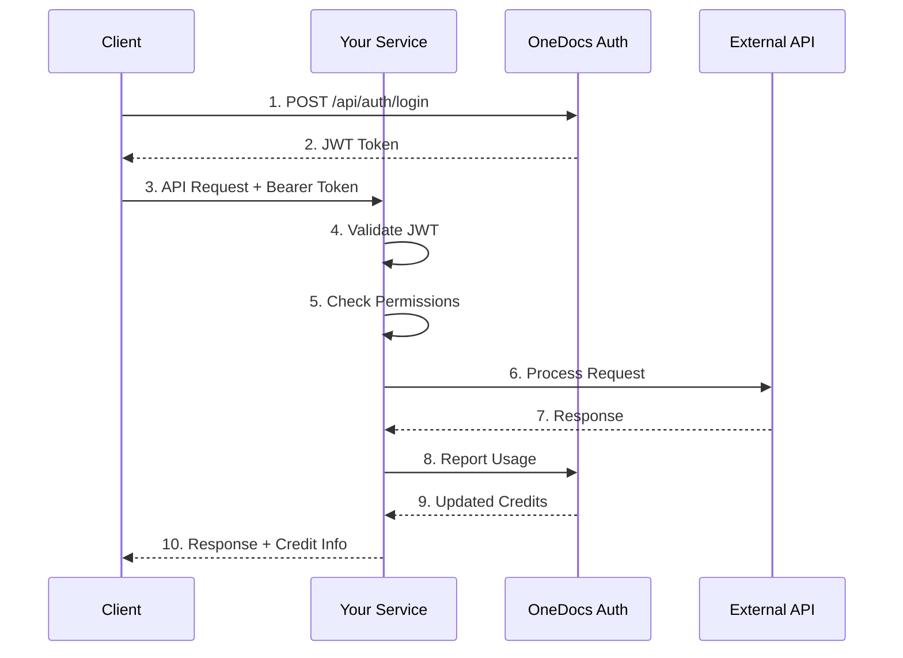

# 🔐 OneDocs Authentication & Authorization Integration Guide

> **Comprehensive guide for integrating OneDocs Auth Service into any microservice**

This document provides step-by-step instructions for implementing JWT-based authentication and authorization in OneDocs microservices, using the OCR service implementation as a reference.

---

## 📋 Table of Contents

- [Overview](#-overview)
- [Architecture](#-architecture)
- [Prerequisites](#-prerequisites)
- [Step 1: Environment Configuration](#-step-1-environment-configuration)
- [Step 2: Core Components](#-step-2-core-components)
- [Step 3: Service Communication](#-step-3-service-communication)
- [Step 4: Endpoint Integration](#-step-4-endpoint-integration)
- [Step 5: Error Handling](#-step-5-error-handling)
- [Step 6: Testing](#-step-6-testing)
- [Best Practices](#-best-practices)
- [Troubleshooting](#-troubleshooting)

---

## 📖 Overview

### What This Integration Provides

- **JWT Token Authentication**: Secure token-based authentication
- **Permission-Based Authorization**: Granular access control with resource:action permissions
- **Credit System Integration**: Automatic usage tracking and credit consumption
- **Service-to-Service Communication**: Reliable communication with OneDocs Auth Service
- **Development Mode**: Easy local development without auth requirements
- **Swagger UI Integration**: Automatic 🔒 Authorize button in API documentation

### Authentication Flow



---

## 🏗️ Architecture

### Component Overview

```
your-service/
├── app/
│   ├── core/
│   │   ├── auth.py              # JWT validation & permission checking
│   │   ├── config.py            # Environment settings
│   │   └── exceptions.py        # Custom auth exceptions
│   ├── services/
│   │   └── auth_service.py      # Auth service client
│   └── api/
│       └── endpoints/           # Protected endpoints
```

### Key Components

1. **JWT Token Validator** (`app/core/auth.py`)
   - Decodes and validates JWT tokens
   - Extracts user context (user_id, email, credits, permissions)
   - Provides FastAPI dependencies

2. **Permission Checker** (`app/core/auth.py`)
   - Validates user permissions against required resource:action
   - Supports wildcard permissions (*, resource:*, etc.)
   - Handles both string and dict permission formats

3. **Auth Service Client** (`app/services/auth_service.py`)
   - Communicates with OneDocs Auth Service
   - Reports usage and consumes credits
   - Handles retries and timeouts

4. **Custom Exceptions** (`app/core/exceptions.py`)
   - AuthenticationError (401)
   - InsufficientCreditsError (403)
   - AuthServiceError (503)
   - QuotaExceededError (429)

---

## ✅ Prerequisites

Before starting, ensure you have:

- **OneDocs Auth Service** running and accessible
- **Python 3.9+** installed
- **FastAPI** and required dependencies
- **JWT Secret Key** (shared with Auth Service)
- **Docker network** configured (if using Docker)

### Required Python Packages

```bash
pip install fastapi
pip install pyjwt
pip install httpx
pip install pydantic-settings
```

---

## 🔧 Step 1: Environment Configuration

### 1.1 Create Environment Variables

Create a `.env` file in your project root:

```env
# JWT Authentication
JWT_SECRET_KEY=your_jwt_secret_key_here_min_32_chars
JWT_ALGORITHM=HS256
REQUIRE_AUTH=true

# Auth Service Configuration
AUTH_SERVICE_URL=http://onedocs-auth:8001
AUTH_SERVICE_TIMEOUT=5
```

**Important Notes:**
- `JWT_SECRET_KEY` must be **identical** to the one used in OneDocs Auth Service
- Use `http://localhost:8001` for local development
- Use `http://onedocs-auth:8001` for Docker/production
- Set `REQUIRE_AUTH=false` only for local development (never in production!)

### 1.2 Update Configuration File

Create or update `app/core/config.py`:

```python
from pydantic_settings import BaseSettings
import os

class Settings(BaseSettings):
    """Application settings"""

    # Your existing settings...

    # Authentication Configuration
    jwt_secret_key: str = os.getenv("JWT_SECRET_KEY", "")
    jwt_algorithm: str = os.getenv("JWT_ALGORITHM", "HS256")
    require_auth: bool = os.getenv("REQUIRE_AUTH", "true").lower() == "true"

    # Auth Service Configuration
    auth_service_url: str = os.getenv("AUTH_SERVICE_URL", "http://localhost:8001")
    auth_service_timeout: int = int(os.getenv("AUTH_SERVICE_TIMEOUT", "5"))

    model_config = {
        "env_file": ".env",
        "case_sensitive": False
    }

settings = Settings()
```

---

## 🔑 Step 2: Core Components

### 2.1 Create Custom Exceptions

Create `app/core/exceptions.py`:

```python
"""Custom exceptions for authentication and authorization"""

from fastapi import HTTPException, Request, status
from fastapi.responses import JSONResponse


class AuthenticationError(HTTPException):
    """Raised when authentication fails"""
    def __init__(self, detail: str = "Authentication failed"):
        super().__init__(
            status_code=status.HTTP_401_UNAUTHORIZED,
            detail=detail,
            headers={"WWW-Authenticate": "Bearer"}
        )


class InsufficientCreditsError(HTTPException):
    """Raised when user has insufficient credits"""
    def __init__(self, detail: str = "Insufficient credits"):
        super().__init__(
            status_code=status.HTTP_403_FORBIDDEN,
            detail=detail
        )


class AuthServiceError(HTTPException):
    """Raised when auth service communication fails"""
    def __init__(self, detail: str = "Auth service unavailable"):
        super().__init__(
            status_code=status.HTTP_503_SERVICE_UNAVAILABLE,
            detail=detail
        )


class QuotaExceededError(HTTPException):
    """Raised when user exceeds their quota"""
    def __init__(self, detail: str = "Quota exceeded"):
        super().__init__(
            status_code=status.HTTP_429_TOO_MANY_REQUESTS,
            detail=detail
        )


# Exception handlers for FastAPI
async def authentication_error_handler(request: Request, exc: AuthenticationError):
    return JSONResponse(
        status_code=exc.status_code,
        content={
            "success": False,
            "error": exc.detail,
            "error_type": "authentication_error"
        },
        headers=exc.headers
    )


async def insufficient_credits_error_handler(request: Request, exc: InsufficientCreditsError):
    return JSONResponse(
        status_code=exc.status_code,
        content={
            "success": False,
            "error": exc.detail,
            "error_type": "insufficient_credits"
        }
    )


async def auth_service_error_handler(request: Request, exc: AuthServiceError):
    return JSONResponse(
        status_code=exc.status_code,
        content={
            "success": False,
            "error": exc.detail,
            "error_type": "auth_service_error"
        }
    )


async def quota_exceeded_error_handler(request: Request, exc: QuotaExceededError):
    return JSONResponse(
        status_code=exc.status_code,
        content={
            "success": False,
            "error": exc.detail,
            "error_type": "quota_exceeded"
        }
    )
```

### 2.2 Create Authentication Module

Create `app/core/auth.py`:

```python
"""Authentication and authorization utilities"""

from datetime import datetime
from typing import Optional, List, Dict, Any, Union
from fastapi import Security, HTTPException, status, Depends
from fastapi.security import HTTPBearer, HTTPAuthorizationCredentials
from pydantic import BaseModel
import jwt
import logging
from app.core.config import settings

logger = logging.getLogger(__name__)

# HTTPBearer security scheme - Creates 🔒 Authorize button in Swagger UI
security = HTTPBearer(auto_error=False)


class UserContext(BaseModel):
    """User context extracted from JWT token"""
    user_id: str
    email: str
    remaining_credits: int = 0
    permissions: List[Union[str, Dict[str, Any]]] = []

    model_config = {"frozen": True}


def decode_jwt_token(token: str) -> dict:
    """
    Decode and validate JWT token

    Args:
        token: JWT token string

    Returns:
        Decoded token payload

    Raises:
        HTTPException: If token is invalid, expired, or malformed
    """
    try:
        payload = jwt.decode(
            token,
            settings.jwt_secret_key,
            algorithms=[settings.jwt_algorithm]
        )

        # Check token expiry
        exp = payload.get("exp")
        if exp:
            exp_time = datetime.fromtimestamp(exp)
            if exp_time < datetime.now():
                raise HTTPException(
                    status_code=status.HTTP_401_UNAUTHORIZED,
                    detail="Token has expired",
                    headers={"WWW-Authenticate": "Bearer"},
                )

        return payload

    except jwt.ExpiredSignatureError:
        raise HTTPException(
            status_code=status.HTTP_401_UNAUTHORIZED,
            detail="Token has expired",
            headers={"WWW-Authenticate": "Bearer"},
        )
    except jwt.InvalidTokenError as e:
        raise HTTPException(
            status_code=status.HTTP_401_UNAUTHORIZED,
            detail=f"Invalid token: {str(e)}",
            headers={"WWW-Authenticate": "Bearer"},
        )


async def get_current_user(
    credentials: Optional[HTTPAuthorizationCredentials] = Security(security)
) -> UserContext:
    """
    FastAPI dependency to extract and validate current user from JWT token.

    Args:
        credentials: HTTP Bearer credentials from Authorization header

    Returns:
        UserContext with user information

    Raises:
        HTTPException: If authentication fails
    """
    # If auth is not required (development mode), return mock user
    if not settings.require_auth:
        logger.info("🔓 Auth disabled, using mock user")
        return UserContext(
            user_id="dev-user",
            email="dev@example.com",
            remaining_credits=999999,
            permissions=["*"]
        )

    # Check if token is provided
    if not credentials:
        raise HTTPException(
            status_code=status.HTTP_401_UNAUTHORIZED,
            detail="Missing authentication token",
            headers={"WWW-Authenticate": "Bearer"},
        )

    # Decode and validate token
    token = credentials.credentials
    payload = decode_jwt_token(token)

    # Extract user information from token payload
    user_id = payload.get("user_id") or payload.get("sub")
    email = payload.get("email")
    remaining_credits = payload.get("remaining_credits", 0)
    permissions = payload.get("permissions", [])

    if not user_id:
        raise HTTPException(
            status_code=status.HTTP_401_UNAUTHORIZED,
            detail="Invalid token: missing user_id",
            headers={"WWW-Authenticate": "Bearer"},
        )

    return UserContext(
        user_id=user_id,
        email=email or "",
        remaining_credits=remaining_credits,
        permissions=permissions
    )


def require_permission(resource: str, action: str):
    """
    Dependency factory to check if user has required permission.

    Args:
        resource: Resource name (e.g., 'ocr', 'image', 'research')
        action: Action name (e.g., 'text', 'analyze', 'query')

    Returns:
        Dependency function that validates user permissions

    Usage:
        @router.post("/api/resource")
        async def endpoint(
            user: UserContext = Depends(require_permission("resource", "action"))
        ):
            ...
    """
    async def permission_checker(
        user: UserContext = Depends(get_current_user)
    ) -> UserContext:
        """Check if user has the required permission."""
        # If auth is disabled, allow everything
        if not settings.require_auth:
            return user

        logger.info(f"🔍 Checking permission: {resource}:{action}")

        # Check permissions
        has_permission = False

        for perm in user.permissions:
            # Handle both string format "resource:action" and dict format
            if isinstance(perm, str):
                if perm == "*":
                    has_permission = True
                    break
                elif perm == f"{resource}:{action}":
                    has_permission = True
                    break
                elif perm == f"{resource}:*":
                    has_permission = True
                    break

            elif isinstance(perm, dict):
                perm_resource = perm.get("resource")
                perm_action = perm.get("action")

                # Global wildcard
                if perm_resource == "*" and perm_action == "*":
                    has_permission = True
                    break

                # Resource wildcard
                if perm_resource == "*":
                    has_permission = True
                    break

                # Action wildcard
                if perm_action == "*" and perm_resource == resource:
                    has_permission = True
                    break

                # Exact match
                if perm_resource == resource and perm_action == action:
                    has_permission = True
                    break

        if not has_permission:
            logger.error(f"🚫 Permission denied: {resource}:{action}")
            raise HTTPException(
                status_code=status.HTTP_403_FORBIDDEN,
                detail=f"Permission denied: {resource}:{action}",
                headers={"WWW-Authenticate": "Bearer"},
            )

        logger.info(f"✅ Permission granted: {resource}:{action}")
        return user

    return permission_checker
```

---

## 🌐 Step 3: Service Communication

### 3.1 Create Auth Service Client

Create `app/services/auth_service.py`:

```python
"""Auth service client for usage tracking and communication"""

import httpx
from datetime import datetime
from typing import Dict, Any, Optional
import asyncio
from app.core.config import settings
from app.core.exceptions import AuthServiceError
import logging

logger = logging.getLogger(__name__)


class AuthServiceClient:
    """Client for communicating with onedocs-auth service"""

    def __init__(self):
        self.base_url = settings.auth_service_url
        self.timeout = settings.auth_service_timeout

    async def consume_usage(
        self,
        user_id: str,
        service_type: str,
        tokens_used: int = 0,
        processing_time: Optional[float] = None,
        metadata: Optional[Dict[str, Any]] = None
    ) -> Dict[str, Any]:
        """
        Notify auth service about usage consumption

        Args:
            user_id: User identifier
            service_type: Type of service (e.g., 'ocr_text', 'image_analyze')
            tokens_used: Number of tokens consumed
            processing_time: Processing time in seconds
            metadata: Additional metadata

        Returns:
            Response from auth service with updated credits

        Raises:
            AuthServiceError: If communication fails
        """
        payload = {
            "user_id": user_id,
            "service_type": service_type,
            "tokens_used": tokens_used,
            "processing_time": processing_time,
            "timestamp": datetime.utcnow().isoformat(),
            "metadata": metadata or {}
        }

        max_retries = 3
        retry_delay = 1  # seconds

        for attempt in range(max_retries):
            try:
                async with httpx.AsyncClient(timeout=self.timeout) as client:
                    response = await client.post(
                        f"{self.base_url}/api/v1/usage/consume",
                        json=payload
                    )

                    if response.status_code == 200:
                        result = response.json()
                        logger.info(
                            f"✅ Usage consumed: user={user_id}, "
                            f"service={service_type}, tokens={tokens_used}"
                        )
                        return result

                    elif response.status_code == 403:
                        logger.warning(f"⚠️ User {user_id} has insufficient credits")
                        return {
                            "success": False,
                            "error": "Insufficient credits",
                            "remaining_credits": 0
                        }

                    else:
                        logger.error(f"❌ Auth service error: {response.status_code}")

                        # Retry on 5xx errors
                        if response.status_code >= 500 and attempt < max_retries - 1:
                            await asyncio.sleep(retry_delay * (attempt + 1))
                            continue

                        raise AuthServiceError(
                            f"Auth service error: {response.status_code}"
                        )

            except httpx.TimeoutException:
                logger.error(f"⏱️ Auth service timeout (attempt {attempt + 1})")
                if attempt < max_retries - 1:
                    await asyncio.sleep(retry_delay * (attempt + 1))
                    continue
                raise AuthServiceError("Auth service timeout")

            except httpx.RequestError as e:
                logger.error(f"❌ Auth service request error: {str(e)}")
                if attempt < max_retries - 1:
                    await asyncio.sleep(retry_delay * (attempt + 1))
                    continue
                raise AuthServiceError(f"Auth service request failed: {str(e)}")

        raise AuthServiceError("Auth service communication failed after retries")

    async def check_health(self) -> bool:
        """Check if auth service is healthy"""
        try:
            async with httpx.AsyncClient(timeout=2) as client:
                response = await client.get(f"{self.base_url}/health")
                return response.status_code == 200
        except Exception as e:
            logger.error(f"❌ Auth service health check failed: {str(e)}")
            return False


# Singleton instance
_auth_service_client = None


def get_auth_service_client() -> AuthServiceClient:
    """Get or create auth service client singleton"""
    global _auth_service_client
    if _auth_service_client is None:
        _auth_service_client = AuthServiceClient()
    return _auth_service_client
```

---

## 🔌 Step 4: Endpoint Integration

### 4.1 Protect Your Endpoints

Update your endpoint to use authentication and authorization:

```python
"""Example protected endpoint"""

from fastapi import APIRouter, Depends, HTTPException
from app.core.auth import get_current_user, UserContext, require_permission
from app.services.auth_service import get_auth_service_client

router = APIRouter()


@router.post("/api/your-endpoint")
async def your_endpoint(
    # Option 1: Just require authentication
    user: UserContext = Depends(get_current_user),

    # Option 2: Require specific permission (recommended)
    # user: UserContext = Depends(require_permission("resource", "action")),
):
    """
    Your protected endpoint

    This endpoint requires:
    - Valid JWT token in Authorization header
    - User must have 'resource:action' permission
    """
    try:
        # Your business logic here
        result = process_request(...)

        # Track usage with auth service
        auth_client = get_auth_service_client()
        usage_result = await auth_client.consume_usage(
            user_id=user.user_id,
            service_type="your_service_type",  # e.g., "ocr_text", "image_analyze"
            tokens_used=100,  # actual tokens used
            processing_time=1.5,  # actual processing time
            metadata={"filename": "example.png"}  # any additional info
        )

        # Get updated credits
        remaining_credits = usage_result.get("remaining_credits", 0)

        return {
            "success": True,
            "data": result,
            "credits_consumed": 1,
            "remaining_credits": remaining_credits
        }

    except Exception as e:
        raise HTTPException(status_code=500, detail=str(e))
```

### 4.2 Real-World Example (OCR Endpoint)

Here's a complete example from the OCR service:

```python
from fastapi import APIRouter, Depends, HTTPException
from app.models.requests import TextExtractionRequest
from app.models.responses import TextExtractionResponse
from app.core.auth import UserContext, require_permission
from app.services.auth_service import get_auth_service_client
from app.services.text_extractor import TextExtractorService
from app.api.dependencies import get_text_extractor

router = APIRouter(prefix="/ocr", tags=["OCR"])


@router.post("/text", response_model=TextExtractionResponse)
async def extract_text(
    request: TextExtractionRequest,
    user: UserContext = Depends(require_permission("research", "query")),
    service: TextExtractorService = Depends(get_text_extractor)
):
    """Extract text from image with authentication"""

    # Process the image
    result = service.process(
        image_data=request.base64,
        custom_prompt=request.custom_prompt
    )

    if not result.success:
        raise HTTPException(status_code=400, detail=result.error)

    # Get processing metrics
    tokens_used = result.data.get("tokens_used", 0)
    processing_time = result.data.get("processing_time")

    # Calculate credits
    credits_consumed = 1
    remaining_credits = max(0, user.remaining_credits - credits_consumed)

    # Report usage to auth service
    auth_client = get_auth_service_client()
    try:
        usage_result = await auth_client.consume_usage(
            user_id=user.user_id,
            service_type="ocr_text",
            tokens_used=tokens_used,
            processing_time=processing_time,
            metadata={"filename": request.filename}
        )

        # Update credits from auth service
        if usage_result.get("remaining_credits") is not None:
            remaining_credits = usage_result.get("remaining_credits")

    except Exception as e:
        # Log but don't fail (request already processed)
        import logging
        logging.warning(f"Failed to notify auth service: {str(e)}")

    # Return response with credit info
    return TextExtractionResponse(
        success=True,
        text=result.data.get("text", ""),
        filename=request.filename,
        model=result.data.get("model", "gpt-4o"),
        tokens_used=tokens_used,
        processing_time=processing_time,
        credits_consumed=credits_consumed,
        remaining_credits=remaining_credits
    )
```

### 4.3 Register Exception Handlers in Main App

Update your `main.py` or `app.py`:

```python
from fastapi import FastAPI
from app.core.exceptions import (
    AuthenticationError,
    InsufficientCreditsError,
    AuthServiceError,
    QuotaExceededError,
    authentication_error_handler,
    insufficient_credits_error_handler,
    auth_service_error_handler,
    quota_exceeded_error_handler
)

app = FastAPI()

# Register exception handlers
app.add_exception_handler(AuthenticationError, authentication_error_handler)
app.add_exception_handler(InsufficientCreditsError, insufficient_credits_error_handler)
app.add_exception_handler(AuthServiceError, auth_service_error_handler)
app.add_exception_handler(QuotaExceededError, quota_exceeded_error_handler)

# Your routes...
```

---

## ❌ Step 5: Error Handling

### 5.1 Standard Error Responses

All authentication errors return consistent JSON format:

#### Authentication Error (401)
```json
{
  "success": false,
  "error": "Missing authentication token",
  "error_type": "authentication_error"
}
```

#### Permission Denied (403)
```json
{
  "success": false,
  "error": "Permission denied: research:query",
  "error_type": "permission_denied"
}
```

#### Insufficient Credits (403)
```json
{
  "success": false,
  "error": "Insufficient credits",
  "error_type": "insufficient_credits"
}
```

#### Auth Service Error (503)
```json
{
  "success": false,
  "error": "Auth service unavailable",
  "error_type": "auth_service_error"
}
```

### 5.2 Error Handling Best Practices

```python
from app.core.exceptions import (
    AuthenticationError,
    InsufficientCreditsError,
    AuthServiceError
)

@router.post("/api/endpoint")
async def endpoint(user: UserContext = Depends(get_current_user)):
    try:
        # Check credits before processing
        if user.remaining_credits < 1:
            raise InsufficientCreditsError(
                "You have no credits remaining. Please purchase more."
            )

        # Your logic...
        result = process_request()

        # Report usage (with error handling)
        try:
            auth_client = get_auth_service_client()
            await auth_client.consume_usage(
                user_id=user.user_id,
                service_type="my_service",
                tokens_used=100
            )
        except AuthServiceError as e:
            # Log but don't fail if auth service is down
            logger.warning(f"Auth service error: {e}")

        return {"success": True, "data": result}

    except InsufficientCreditsError:
        # Re-raise to be handled by exception handler
        raise
    except Exception as e:
        logger.error(f"Unexpected error: {e}")
        raise HTTPException(status_code=500, detail=str(e))
```

---

## 🧪 Step 6: Testing

### 6.1 Test Authentication Flow

```bash
# 1. Get authentication token
curl -X POST http://localhost:8001/api/auth/login \
  -H "Content-Type: application/json" \
  -d '{
    "email": "user@example.com",
    "password": "password"
  }'

# Response:
# {
#   "access_token": "eyJhbGc...",
#   "token_type": "bearer"
# }

# 2. Use token in your service
export TOKEN="eyJhbGc..."

curl -X POST http://localhost:8765/api/your-endpoint \
  -H "Authorization: Bearer $TOKEN" \
  -H "Content-Type: application/json" \
  -d '{"data": "..."}'
```

### 6.2 Test with Swagger UI

1. Go to `http://localhost:8765/docs`
2. Click 🔒 **Authorize** button (top right)
3. Enter your JWT token (without "Bearer" prefix)
4. Click **Authorize**, then **Close**
5. All requests will now include the token

### 6.3 Unit Tests

```python
import pytest
from fastapi.testclient import TestClient
from app.main import app

client = TestClient(app)

def test_endpoint_requires_auth():
    """Test that endpoint requires authentication"""
    response = client.post("/api/endpoint", json={})
    assert response.status_code == 401
    assert "authentication" in response.json()["error_type"]

def test_endpoint_with_valid_token():
    """Test endpoint with valid token"""
    # Get token
    auth_response = client.post(
        "http://localhost:8001/api/auth/login",
        json={"email": "test@example.com", "password": "password"}
    )
    token = auth_response.json()["access_token"]

    # Use token
    response = client.post(
        "/api/endpoint",
        headers={"Authorization": f"Bearer {token}"},
        json={"data": "test"}
    )

    assert response.status_code == 200
    assert response.json()["success"] is True

def test_permission_denied():
    """Test permission denied"""
    # Create token with wrong permissions
    # ... (mock token creation)

    response = client.post(
        "/api/endpoint",
        headers={"Authorization": f"Bearer {token}"},
        json={"data": "test"}
    )

    assert response.status_code == 403
    assert "permission_denied" in response.json()["error_type"]
```

### 6.4 Development Mode Testing

For local development without auth:

```bash
# In .env
REQUIRE_AUTH=false

# All endpoints will use mock user with unlimited credits
# user_id: "dev-user"
# email: "dev@example.com"
# permissions: ["*"]
# credits: 999999
```

---

## ✨ Best Practices

### 1. Permission Naming Convention

Use consistent resource:action format:

```python
# ✅ Good
require_permission("ocr", "text")
require_permission("image", "analyze")
require_permission("document", "process")
require_permission("research", "query")

# ❌ Bad
require_permission("text_extraction", "run")
require_permission("analyze-image", "start")
```

### 2. Service Type Naming

Use descriptive, consistent service type names:

```python
# ✅ Good
service_type="ocr_text"
service_type="ocr_structured"
service_type="image_analyze"
service_type="document_process"

# ❌ Bad
service_type="text"
service_type="img"
service_type="process"
```

### 3. Credit Consumption

Always report usage to auth service:

```python
# ✅ Good - Report after successful processing
result = process_request()
await auth_client.consume_usage(
    user_id=user.user_id,
    service_type="my_service",
    tokens_used=actual_tokens,
    processing_time=actual_time,
    metadata={"filename": filename}
)

# ❌ Bad - Don't report before processing
await auth_client.consume_usage(...)  # ← What if processing fails?
result = process_request()
```

### 4. Error Handling

Handle auth service errors gracefully:

```python
# ✅ Good - Log and continue if already processed
try:
    await auth_client.consume_usage(...)
except AuthServiceError as e:
    logger.warning(f"Failed to report usage: {e}")
    # Don't fail the request

# ❌ Bad - Fail the request if auth service is down
await auth_client.consume_usage(...)  # ← Will raise error
```

### 5. Logging

Use consistent, informative log messages:

```python
# ✅ Good
logger.info(f"✅ User {user.user_id} authenticated successfully")
logger.info(f"🔍 Checking permission: {resource}:{action}")
logger.error(f"🚫 Permission denied: {resource}:{action}")

# ❌ Bad
logger.info("user logged in")
logger.info("checking perm")
logger.error("denied")
```

### 6. Token Expiry Handling

Always check token expiry:

```python
# ✅ Already handled in decode_jwt_token()
exp = payload.get("exp")
if exp and datetime.fromtimestamp(exp) < datetime.now():
    raise HTTPException(status_code=401, detail="Token has expired")
```

### 7. Development vs Production

```python
# ✅ Good - Different configs for different environments
# Development: .env
REQUIRE_AUTH=false
AUTH_SERVICE_URL=http://localhost:8001

# Production: .env
REQUIRE_AUTH=true
AUTH_SERVICE_URL=http://onedocs-auth:8001

# ❌ Bad - Same config for all environments
```

---

## 🔧 Troubleshooting

### Common Issues

#### 1. "Missing authentication token"

**Problem:** No token in Authorization header

**Solution:**
```bash
# Ensure header format is correct
curl -H "Authorization: Bearer YOUR_TOKEN" ...

# In Swagger UI: Click Authorize and enter token
```

#### 2. "Invalid token" or "Token has expired"

**Problem:** Token is invalid or expired

**Solution:**
```bash
# Get a fresh token
curl -X POST http://localhost:8001/api/auth/login \
  -H "Content-Type: application/json" \
  -d '{"email": "user@example.com", "password": "password"}'
```

#### 3. "Permission denied"

**Problem:** User lacks required permission

**Solution:**
- Check user's permissions in auth service
- Verify permission format matches: `resource:action`
- Contact admin to add permission

#### 4. "Auth service unavailable"

**Problem:** Cannot connect to auth service

**Solution:**
```bash
# Check auth service is running
curl http://localhost:8001/health

# Check Docker network (if using Docker)
docker network inspect onedocstoolkit-network-dev

# Verify AUTH_SERVICE_URL in .env
AUTH_SERVICE_URL=http://onedocs-auth:8001  # or localhost:8001
```

#### 5. "JWT Secret Key Mismatch"

**Problem:** Different JWT_SECRET_KEY between services

**Solution:**
```bash
# Ensure SAME secret key in both services
# Auth Service .env
JWT_SECRET_KEY=your_secret_key_here

# Your Service .env
JWT_SECRET_KEY=your_secret_key_here  # ← Must match!
```

#### 6. Swagger UI Authorization Not Working

**Problem:** 🔒 button not appearing or not working

**Solution:**
```python
# Ensure HTTPBearer is configured correctly
from fastapi.security import HTTPBearer

security = HTTPBearer(auto_error=False)

# Use Security() in dependency
async def get_current_user(
    credentials: Optional[HTTPAuthorizationCredentials] = Security(security)
):
    ...
```

### Debug Checklist

- [ ] JWT_SECRET_KEY matches auth service
- [ ] AUTH_SERVICE_URL is correct
- [ ] Auth service is running and healthy
- [ ] Token is not expired
- [ ] User has required permission
- [ ] Docker network is configured (if using Docker)
- [ ] Exception handlers are registered
- [ ] HTTPBearer security is configured

### Logging Debug Info

Enable debug logging:

```python
import logging

logging.basicConfig(level=logging.DEBUG)

# Or in specific module
logger = logging.getLogger(__name__)
logger.setLevel(logging.DEBUG)
```

---

## 📝 Summary Checklist

Before deploying your service with auth integration:

- [ ] ✅ Environment variables configured (.env)
- [ ] ✅ config.py updated with auth settings
- [ ] ✅ Custom exceptions created (exceptions.py)
- [ ] ✅ Authentication module implemented (auth.py)
- [ ] ✅ Auth service client created (auth_service.py)
- [ ] ✅ Endpoints protected with require_permission()
- [ ] ✅ Usage tracking implemented
- [ ] ✅ Exception handlers registered in main app
- [ ] ✅ Swagger UI 🔒 Authorize button working
- [ ] ✅ Tests written for auth flow
- [ ] ✅ Development mode tested (REQUIRE_AUTH=false)
- [ ] ✅ Production mode tested (REQUIRE_AUTH=true)
- [ ] ✅ Error handling implemented
- [ ] ✅ Logging configured
- [ ] ✅ Docker network configured (if using Docker)

---

## 📚 Additional Resources

- **OneDocs Auth Service**: Main authentication service
- **JWT.io**: Debug and decode JWT tokens
- **FastAPI Security**: https://fastapi.tiangolo.com/tutorial/security/
- **OAuth2 with Password Flow**: https://fastapi.tiangolo.com/tutorial/security/simple-oauth2/

---

## 🆘 Support

For issues or questions:

- Check this documentation first
- Review OneDocs Auth Service documentation
- Check application logs for detailed error messages
- Contact DevOps team for infrastructure issues
- Open issue in project repository

---

**Last Updated:** 2025-10-03
**Version:** 1.0.0
**Based On:** OneDocs OCR Service Implementation
