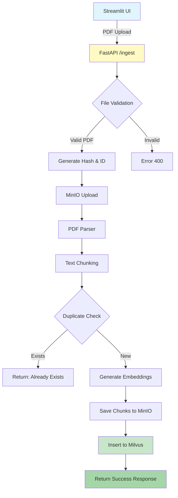

# RAG Pipeline Ingestion Flow Documentation

## 📊 Complete Data Flow: Streamlit → FastAPI → Storage

Bu dokümantasyon, bir PDF dosyasının Streamlit UI'dan yüklenmesinden, işlenmesi ve depolanmasına kadar olan tüm süreci detaylı olarak açıklamaktadır.

---

## 1️⃣ **Streamlit UI - Dosya Yükleme**

### Lokasyon: `streamlit_app.py` (satır 26-45)

### İşlem Adımları:
1. **Kullanıcı PDF seçer** 
   - Component: `st.file_uploader()`
   - Kabul edilen format: `type=['pdf']`
   - Return type: `UploadedFile` object

2. **Dosya bilgileri gösterilir**
   ```python
   - uploaded_file.name     # String: "dokuman.pdf"
   - uploaded_file.size     # Integer: 1048576 (bytes)
   - uploaded_file.type     # String: "application/pdf"
   ```

3. **Process butonuna basılır**
   - HTTP Request hazırlanır:
   ```python
   files = {
       "file": (
           uploaded_file.name,    # String: dosya adı
           uploaded_file,         # BytesIO: dosya içeriği
           "application/pdf"      # String: MIME type
       )
   }
   ```

4. **API'ye POST isteği**
   ```python
   response = requests.post(
       "http://localhost:8080/ingest",
       files=files,
       timeout=300  # 5 dakika timeout
   )
   ```

### Çıktı:
```json
{
    "success": true,
    "document_id": "doc_a3f5b2c8d9e1f4g6",
    "document_title": "dokuman.pdf",
    "chunks_created": 25,
    "processing_time": 12.5,
    "file_hash": "a3f5b2c8d9e1f4g6h7i8j9k0l1m2n3o4",
    "message": "Document successfully ingested with 25 chunks"
}
```

---

## 2️⃣ **FastAPI - Dosya Alımı ve Validasyon**

### Lokasyon: `production_server.py` (satır 186-209)

### Endpoint: `POST /ingest`

### İşlem Adımları:

1. **Dosya Alımı**
   ```python
   file: UploadFile = File(...)
   # UploadFile özellikleri:
   # - filename: str
   # - content_type: str
   # - file: SpooledTemporaryFile
   ```

2. **Dosya Tipi Validasyonu**
   ```python
   if not file.filename.lower().endswith('.pdf'):
       raise HTTPException(status_code=400, detail="Only PDF files are supported")
   ```

3. **PDF Binary Data Okuma**
   ```python
   pdf_data = await file.read()  # bytes: PDF binary içeriği
   # Örnek: b'%PDF-1.4\n%\xc3\xa4\xc3\xbc...'
   ```

4. **MD5 Hash Hesaplama**
   ```python
   file_hash = hashlib.md5(pdf_data).hexdigest()
   # String: "a3f5b2c8d9e1f4g6h7i8j9k0l1m2n3o4" (32 karakter)
   ```

5. **Document ID Oluşturma**
   ```python
   document_id = f"doc_{file_hash[:16]}"
   # String: "doc_a3f5b2c8d9e1f4g6" (ilk 16 karakter kullanılır)
   ```

### Data Transformasyonu:
```
UploadFile → bytes → MD5 hash → document_id
```

---

## 3️⃣ **MinIO Storage - Dosya Depolama**

### Lokasyon: `production_server.py` (satır 210-238)

### İki Bucket'a Yükleme:

#### A. **rag-docs Bucket** (Chunking için)
```python
minio_doc_id = storage_service.upload_pdf(
    file_data=pdf_data,           # bytes
    filename=file.filename,       # String: "dokuman.pdf"
    metadata={
        "document_id": document_id,  # String: "doc_a3f5b2c8d9e1f4g6"
        "file_hash": file_hash       # String: 32 karakter MD5
    }
)
# Return: String - MinIO object ID
```

#### B. **raw-documents Bucket** (Orijinal saklanması için)
```python
success = storage_service.upload_pdf_to_raw_documents(
    document_id=document_id,
    file_data=pdf_data,
    filename=file.filename,
    metadata={
        "document_id": document_id,
        "file_hash": file_hash,
        "original_filename": file.filename
    }
)
# Return: Boolean - başarı durumu
```

### MinIO'da Depolama Yapısı:
```
minio/
├── rag-docs/
│   └── doc_a3f5b2c8d9e1f4g6.pdf
└── raw-documents/
    └── doc_a3f5b2c8d9e1f4g6/
        └── dokuman.pdf
```

---

## 4️⃣ **PDF Parsing - Metin Çıkarma**

### Lokasyon: `production_server.py` (satır 240-246)

### İşlem:
```python
parser = PDFParser()
pages, metadata = parser.extract_text_from_pdf(pdf_data)
```

### Çıktı Data Yapısı:
```python
# pages: List[Page]
Page = {
    "text": str,           # Sayfa metni
    "page_number": int,    # Sayfa numarası (1-indexed)
    "metadata": dict       # Ek metadata
}

# metadata: PDFMetadata
PDFMetadata = {
    "title": str,          # PDF başlığı
    "author": str,         # Yazar
    "subject": str,        # Konu
    "creator": str,        # Oluşturan uygulama
    "producer": str,       # PDF producer
    "creation_date": str,  # Oluşturma tarihi
    "modification_date": str,  # Son değişiklik
    "pages": int           # Toplam sayfa sayısı
}
```

---

## 5️⃣ **Text Chunking - Metin Parçalama**

### Lokasyon: `production_server.py` (satır 248-269)

### İşlem:
```python
chunks = []
for i, page in enumerate(pages):
    text = page.text.strip()
    if len(text) > 100:  # 100 karakterden kısa sayfaları atla
        chunk_id = f"{document_id}_{i:04d}"
        chunk = SimpleChunk(
            chunk_id=chunk_id,
            text=text,
            page_number=page.page_number
        )
        chunks.append(chunk)
```

### Chunk Data Yapısı:
```python
@dataclass
class SimpleChunk:
    chunk_id: str      # "doc_a3f5b2c8d9e1f4g6_0001"
    text: str          # Chunk metni
    page_number: int   # Hangi sayfadan geldiği
```

---

## 6️⃣ **Embedding Generation - Vektör Oluşturma**

### Lokasyon: `production_server.py` (satır 306-383)

### OpenAI API ile Batch Processing:

```python
# Batch boyutu: 20 chunk
batch_size = 20

for batch_start in range(0, len(chunks), batch_size):
    batch_texts = [chunk.text for chunk in batch_chunks]
    
    # OpenAI API çağrısı
    response = openai_client.embeddings.create(
        model='text-embedding-3-small',
        input=batch_texts  # List[str]
    )
    
    # Embedding boyutu kısaltma (1536 → 384)
    batch_embeddings = [data.embedding[:384] for data in response.data]
```

### Embedding Özellikleri:
```python
# Orijinal: 1536 boyut (text-embedding-3-small)
# Kısaltılmış: 384 boyut (Milvus collection şemasına uygun)
# Tip: List[float]
# Örnek: [0.023, -0.045, 0.112, ..., 0.089]  # 384 float değer
```

---

## 7️⃣ **MinIO Chunk Storage - Chunk Depolama**

### Lokasyon: `production_server.py` (satır 385-399)

### Her chunk için ayrı JSON dosyası:
```python
for i, (chunk_id, text) in enumerate(zip(chunk_ids, texts)):
    storage_service.upload_chunk(
        document_id=document_id,      # "doc_a3f5b2c8d9e1f4g6"
        chunk_id=chunk_id,            # "doc_a3f5b2c8d9e1f4g6_0001"
        chunk_text=text,              # Chunk metni
        metadata={
            "page_num": page_nums[i],
            "chunk_index": chunk_indices[i]
        }
    )
```

### MinIO'da Chunk Yapısı:
```
minio/rag-chunks/
└── doc_a3f5b2c8d9e1f4g6/
    ├── doc_a3f5b2c8d9e1f4g6_0000.json
    ├── doc_a3f5b2c8d9e1f4g6_0001.json
    ├── doc_a3f5b2c8d9e1f4g6_0002.json
    └── ...
```

### JSON İçeriği:
```json
{
    "chunk_id": "doc_a3f5b2c8d9e1f4g6_0001",
    "text": "Bu chunk'ın metin içeriği...",
    "metadata": {
        "page_num": 1,
        "chunk_index": 0
    }
}
```

---

## 8️⃣ **Milvus Vector Storage - Vektör Depolama**

### Lokasyon: `production_server.py` (satır 401-447)

### Milvus Collection Şeması:
```python
fields = [
    "id",           # VARCHAR(100) - Primary key
    "document_id",  # VARCHAR(100) 
    "chunk_index",  # INT64
    "text",         # VARCHAR(65535)
    "embedding",    # FLOAT_VECTOR(384)
    "metadata"      # JSON
]
```

### Data Hazırlama ve Insert:
```python
# Metadata hazırlama
combined_metadata = {
    "chunk_id": chunk_id,
    "page_number": page_number,
    "minio_object_path": f"{document_id}/{chunk_id}.json",
    "document_title": document_title,
    "file_hash": file_hash,
    "created_at": timestamp
}

# Batch insert data
data = [
    ids,                 # List[str]
    document_ids,        # List[str]
    chunk_indices,       # List[int]
    texts,              # List[str]
    embeddings,          # List[List[float]]
    combined_metadata    # List[dict]
]

insert_result = collection.insert(data)
collection.load()  # Immediate search için yeniden yükle
```

---

## 9️⃣ **Response - İstemciye Dönüş**

### Final Response Yapısı:
```python
IngestResponse = {
    "success": True,
    "document_id": "doc_a3f5b2c8d9e1f4g6",
    "document_title": "dokuman.pdf",
    "chunks_created": 25,
    "processing_time": 12.5,  # saniye
    "file_hash": "a3f5b2c8d9e1f4g6h7i8j9k0l1m2n3o4",
    "message": "Document successfully ingested with 25 chunks"
}
```

---

## 📈 **Performans Metrikleri**

### Tipik İşlem Süreleri:
- **PDF Parsing**: ~0.5-2 saniye (sayfa sayısına göre)
- **Chunking**: ~0.1-0.5 saniye
- **Embedding Generation**: ~2-10 saniye (chunk sayısına göre)
- **MinIO Upload**: ~1-3 saniye
- **Milvus Insert**: ~0.5-2 saniye
- **Toplam**: ~5-20 saniye (dosya boyutuna göre)

### Batch Processing Optimizasyonları:
- OpenAI Embedding: 20 chunk/batch
- Milvus Insert: Tek seferde tüm chunks
- MinIO Upload: Paralel işlem mümkün

---

## 🔍 **Duplicate Check - Tekrar Kontrolü**

### Lokasyon: `production_server.py` (satır 276-291)

```python
# Milvus'ta aynı document_id var mı kontrol et
search_existing = collection.query(
    expr=f'document_id == "{document_id}"',
    output_fields=['id'],
    limit=1
)

if search_existing:
    # Dosya zaten var, işlemi durdur
    return IngestResponse(
        success=False,
        message="Document already exists in database"
    )
```

---

## 🚨 **Error Handling - Hata Yönetimi**

### Her Aşamada Try-Catch:

1. **MinIO Upload Hatası**: Log kaydedilir, işlem devam eder
2. **PDF Parse Hatası**: HTTPException(500) fırlatılır
3. **Embedding Hatası**: HTTPException(500) fırlatılır
4. **Milvus Insert Hatası**: Response'da hata döndürülür

### Retry Mechanism:
```python
@retry_with_backoff(max_retries=3)
async def ingest_document(file: UploadFile):
    # 3 deneme hakkı ile
```

---

## 📊 **Data Flow Diagram**



---

## 📝 **Özet**

Bu pipeline, PDF dosyalarını:
1. **Alır ve doğrular** (FastAPI)
2. **Hashler ve ID oluşturur** (MD5)
3. **Depolar** (MinIO - 2 bucket)
4. **Parse eder** (PyMuPDF)
5. **Chunk'lara böler** (Simple chunking)
6. **Vektörleştirir** (OpenAI embeddings)
7. **Chunk'ları saklar** (MinIO JSON)
8. **Vektör DB'ye ekler** (Milvus)
9. **Sonucu döndürür** (JSON response)

Tüm süreç ortalama **5-20 saniye** sürer ve **fault-tolerant** yapıdadır.