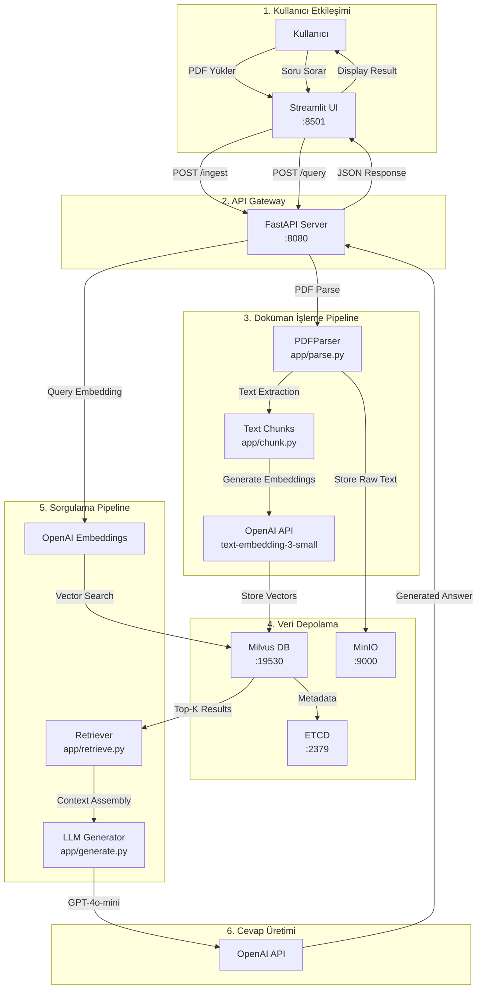

# OneDocs RAG Sistemi - Veri Akış Mimarisi

## 🎯 Genel Bakış

OneDocs RAG sistemi, PDF dokümanlarını işleyen, vektör veritabanında saklayan ve kullanıcı sorularına kaynak göstererek cevap veren bir Retrieval-Augmented Generation (RAG) uygulamasıdır.

## 📊 Sistem Bileşenleri

### 1. Frontend Katmanı
- **Streamlit Web Uygulaması** (`streamlit_app.py`)
  - Port: 8501
  - Kullanıcı arayüzü ve chat interface
  - PDF yükleme ve soru-cevap işlemleri

### 2. Backend API Katmanı
- **Production Server** (`production_server.py`)
  - Port: 8080
  - FastAPI tabanlı REST API
  - Kalıcı veri depolama ile optimize edilmiş

- **Development Server** (`app/server.py`)
  - Port: 8080
  - WebSocket destekli gelişmiş özellikler
  - Kapsamlı API endpoint'leri

### 3. Veri Depolama Katmanı
- **Milvus Vector Database**
  - Port: 19530 (gRPC)
  - Vektör embedding'lerini saklar
  - Collection: `rag_production_v1`

- **MinIO Object Storage**
  - Port: 9000 (API), 9001 (Console)
  - Ham doküman ve metin verilerini saklar

- **ETCD**
  - Port: 2379
  - Metadata yönetimi

## 🔄 Veri Akış Diyagramı



## 📥 Doküman Yükleme Akışı (Ingestion Flow)

### Adım 1: PDF Yükleme
```
Kullanıcı → Streamlit UI → Multipart Form Data → FastAPI /ingest endpoint
```

### Adım 2: PDF İşleme
```python
# production_server.py:100-115
1. PDF validasyonu (sadece .pdf uzantılı dosyalar)
2. MD5 hash hesaplama (duplicate kontrolü için)
3. Document ID oluşturma: doc_{hash[:16]}
```

### Adım 3: Text Extraction
```python
# app/parse.py → PDFParser.extract_text_from_pdf()
1. PyMuPDF ile PDF parsing
2. Her sayfa için text ve metadata çıkarma
3. PageContent objeleri oluşturma
```

### Adım 4: Text Chunking
```python
# production_server.py:131-151
1. Her sayfa metni için chunk oluşturma
2. 100 karakterden kısa sayfalar atlanır
3. Chunk ID formatı: chunk_{doc_id}_{page_index}_{hash}
```

### Adım 5: Embedding Generation
```python
# production_server.py:178-214
1. OpenAI API çağrısı (text-embedding-3-small)
2. Her chunk için 1536 boyutlu vektör
3. Batch processing (5 chunk'ta bir log)
```

### Adım 6: Milvus Storage
```python
# production_server.py:216-226
1. Vektörler ve metadata Milvus'a insert edilir
2. Collection: rag_production_v1
3. Alanlar: chunk_id, document_id, document_title, text, embedding, page_num, chunk_index, created_at, file_hash
```

## 🔍 Sorgulama Akışı (Query Flow)

### Adım 1: Kullanıcı Sorusu
```
Kullanıcı → Streamlit Chat Input → POST /query → FastAPI
```

### Adım 2: Query Embedding
```python
# production_server.py:273-278
1. Soru metni OpenAI embeddings API'ye gönderilir
2. 1536 boyutlu query vektörü oluşturulur
```

### Adım 3: Vector Search
```python
# production_server.py:285-293
1. Milvus'ta cosine similarity search
2. Top-K (varsayılan 3) en benzer chunk bulunur
3. Optional: document_id filtresi uygulanabilir
```

### Adım 4: Context Assembly
```python
# production_server.py:303-325
1. Her sonuç için score, document info, text alınır
2. Context formatı: [Kaynak N - Sayfa X]: {text}
3. Sources array hazırlanır (rank, score, preview)
```

### Adım 5: LLM Generation
```python
# production_server.py:330-351
1. System prompt: RAG asistanı rolü
2. Context ve soru GPT-4o-mini'ye gönderilir
3. Max 500 token cevap üretilir
4. Kaynak referansları eklenir
```

### Adım 6: Response
```json
{
  "answer": "Cevap metni [Kaynak 1]...",
  "sources": [
    {
      "rank": 1,
      "score": 0.95,
      "document_title": "Doküman Adı",
      "page_number": 5,
      "text_preview": "İlgili metin...",
      "created_at": "2024-01-01T10:00:00"
    }
  ],
  "processing_time": 1.5,
  "model_used": "gpt-4o-mini"
}
```

## 🔧 Teknik Detaylar

### Embedding Boyutları
- OpenAI text-embedding-3-small: 1536 boyut
- Local models (multilingual-e5-small): değişken boyut

### Token Limitleri
- Chunk boyutu: 512 token
- Overlap: 50 token
- LLM response: max 500 token

### Veritabanı Şeması

#### Milvus Collection: rag_production_v1
```python
Fields:
- id: int64 (primary key, auto-generated)
- chunk_id: varchar(255)
- document_id: varchar(255)
- document_title: varchar(1024)
- text: varchar(65535)
- embedding: float_vector(1536)
- page_num: int64
- chunk_index: int64
- created_at: varchar(50)
- file_hash: varchar(64)

Index:
- Type: IVF_FLAT
- Metric: COSINE
- nlist: 128
```

### API Endpoint'leri

#### Production Server
- `GET /health` - Sistem sağlık kontrolü
- `POST /ingest` - PDF doküman yükleme
- `POST /query` - Soru sorma
- `GET /documents` - Doküman listesi
- `DELETE /documents/{document_id}` - Doküman silme

### Docker Servisleri
```yaml
Services:
- app (FastAPI): Port 8080
- streamlit: Port 8501
- milvus: Port 19530, 9091
- minio: Port 9000, 9001
- etcd: Port 2379
- attu (Milvus GUI): Port 8000
```

## 🚀 Performans Optimizasyonları

### 1. Batch Processing
- Embedding generation batch halinde yapılır
- Her 5 chunk'ta bir progress log

### 2. Connection Pooling
- Milvus connection reuse
- OpenAI client singleton pattern

### 3. Caching
- Document hash ile duplicate kontrolü
- Existing document check before insert

### 4. Async Operations
- FastAPI async endpoints
- Background task support

## 📈 Veri Akış Özeti

1. **Giriş Noktası**: Kullanıcı Streamlit UI üzerinden PDF yükler veya soru sorar
2. **API İletişimi**: Streamlit, FastAPI backend'e HTTP request gönderir
3. **PDF İşleme**: PyMuPDF → Chunking → OpenAI Embeddings
4. **Veri Saklama**: Vektörler Milvus'a, metinler MinIO'ya
5. **Sorgulama**: Query embedding → Vector search → Context assembly
6. **Cevap Üretimi**: GPT-4o-mini ile kaynak referanslı cevap
7. **Sonuç**: JSON response → Streamlit UI → Kullanıcıya gösterim

## 🔐 Güvenlik ve Yetkilendirme

### Mevcut Durum
- CORS: Tüm origin'lere açık (*)
- Authentication: YOK
- Rate limiting: YOK
- Input validation: Sadece dosya tipi kontrolü

### Production İçin Öneriler
- JWT tabanlı authentication
- API key management
- Rate limiting (per IP/user)
- Input sanitization
- SSL/TLS configuration

## 📊 Monitoring ve Logging

### Log Seviyeleri
- INFO: Normal işlemler
- ERROR: Hata durumları
- DEBUG: Detaylı debugging (development)

### Metrikler
- Processing time tracking
- Entity count monitoring
- Query performance metrics
- Document ingestion stats

## 🎯 Kullanım Senaryoları

1. **Doküman Yükleme**
   - Kullanıcı PDF yükler
   - Sistem otomatik olarak işler ve indexler
   - Duplicate kontrolü yapılır

2. **Soru-Cevap**
   - Kullanıcı soru sorar
   - Sistem en ilgili chunk'ları bulur
   - Kaynak göstererek cevap üretir

3. **Doküman Yönetimi**
   - Yüklenen dokümanları listeleme
   - Belirli bir dokümanı silme
   - Doküman bazlı filtreleme

## 📝 Notlar

- Production server (`production_server.py`) daha basit ve optimize edilmiş
- Development server (`app/server.py`) daha fazla özellik içerir (WebSocket, background tasks)
- Tüm işlemler async/await pattern kullanır
- Docker-first deployment stratejisi uygulanmış