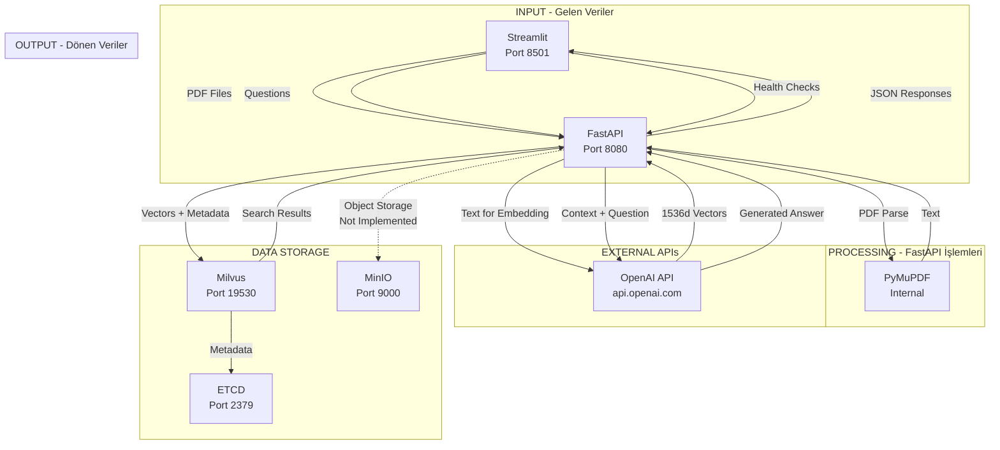

# FastAPI İletişim Akışı - Detaylı Analiz

## 🎯 Genel Bakış

FastAPI backend (`production_server.py`) sistemin merkezi orkestratörüdür. Port 8080'de çalışan FastAPI:
- Streamlit'ten gelen HTTP requestleri alır
- External API'lerle (OpenAI) iletişim kurar
- Veritabanları (Milvus, MinIO) ile veri alışverişi yapar
- İşlenmiş sonuçları Streamlit'e geri döner

## 🔗 FastAPI'nin İletişim Kurduğu Servisler

### 1. **Milvus Vector Database** (localhost:19530)
### 2. **OpenAI API** (api.openai.com)
### 3. **MinIO Object Storage** (localhost:9000) - *İmplemente edilmemiş*
### 4. **ETCD** (localhost:2379) - *Dolaylı, Milvus üzerinden*

## 📡 Detaylı İletişim Akışları

---

## 1️⃣ MILVUS İLE İLETİŞİM

### Bağlantı Kurma
```python
from pymilvus import connections, Collection

# Bağlantı
connections.connect('default', host='localhost', port='19530')

# Collection erişimi
collection = Collection('rag_production_v1')
```

### A) Health Check - Milvus Durumu Kontrolü

#### FastAPI → Milvus
```python
# production_server.py:80-84
collection = Collection('rag_production_v1')
entity_count = collection.num_entities  # Entity sayısını al
```

#### Milvus → FastAPI
```python
{
    "entity_count": 1234  # Toplam vektör sayısı
}
```

### B) Document Duplicate Check

#### FastAPI → Milvus
```python
# production_server.py:160-164
search_existing = collection.query(
    expr=f'document_id == "{document_id}"',  # SQL-like expression
    output_fields=['id'],
    limit=1
)
```

#### Milvus → FastAPI
```python
[] # Boş liste = doküman yok
# veya
[{"id": 123456}] # Doküman mevcut
```

### C) Vector Insertion (Embedding Storage)

#### FastAPI → Milvus
```python
# production_server.py:219-225
data = [
    chunk_ids,        # ["chunk_doc_abc_0001", ...]
    document_ids,     # ["doc_abc123", ...]
    document_titles,  # ["Doküman Başlığı", ...]
    texts,           # ["Chunk metni...", ...]
    embeddings,      # [[0.1, 0.2, ...], ...] # 1536 boyutlu
    page_nums,       # [1, 2, 3, ...]
    chunk_indices,   # [0, 1, 2, ...]
    created_ats,     # ["2024-01-01T10:00:00", ...]
    file_hashes      # ["abc123def456", ...]
]

insert_result = collection.insert(data)
collection.load()  # Index'i yeniden yükle
```

#### Milvus → FastAPI
```python
{
    "insert_count": 25,
    "ids": [1, 2, 3, ...],  # Auto-generated IDs
    "succ_index": [0, 1, 2, ...],
    "err_index": []
}
```

### D) Vector Search (Query)

#### FastAPI → Milvus
```python
# production_server.py:286-293
search_results = collection.search(
    [query_embedding],        # 1536 boyutlu query vektörü
    'embedding',             # Arama yapılacak alan
    {'metric_type': 'COSINE'},  # Benzerlik metriği
    limit=top_k,             # Top-K sonuç (default: 3)
    expr=expr,               # Optional filter: 'document_id == "doc_123"'
    output_fields=['document_id', 'document_title', 'text', 'page_num', 'created_at']
)
```

#### Milvus → FastAPI
```python
[
    [  # First query results
        {
            "id": 123,
            "distance": 0.95,  # Cosine similarity score
            "entity": {
                "document_id": "doc_abc123",
                "document_title": "Örnek Doküman",
                "text": "İlgili metin içeriği...",
                "page_num": 3,
                "created_at": "2024-01-01T10:00:00"
            }
        },
        {...}  # Diğer sonuçlar
    ]
]
```

### E) Document List Query

#### FastAPI → Milvus
```python
# production_server.py:381-384
results = collection.query(
    expr="chunk_index == 0",  # Her dokümanın ilk chunk'ı
    output_fields=['document_id', 'document_title', 'created_at', 'file_hash']
)
```

### F) Document Deletion

#### FastAPI → Milvus
```python
# production_server.py:422-432
# Önce chunk'ları bul
chunks = collection.query(
    expr=f'document_id == "{document_id}"',
    output_fields=['id']
)

# Sonra sil
ids_to_delete = [chunk['id'] for chunk in chunks]
collection.delete(f"id in {ids_to_delete}")
```

---

## 2️⃣ OPENAI API İLE İLETİŞİM

### API Client Başlatma
```python
from openai import OpenAI
client = OpenAI()  # API key .env'den okunur
```

### A) Text Embedding Generation (Ingestion)

#### FastAPI → OpenAI
```python
# production_server.py:197-200
response = client.embeddings.create(
    model='text-embedding-3-small',
    input=chunk.text  # Metin içeriği
)
```

#### Request (HTTP POST to api.openai.com/v1/embeddings)
```json
{
    "model": "text-embedding-3-small",
    "input": "Bu bir örnek metin içeriğidir..."
}
```

#### OpenAI → FastAPI
```json
{
    "object": "list",
    "data": [
        {
            "object": "embedding",
            "index": 0,
            "embedding": [0.1, -0.2, 0.3, ...]  // 1536 boyutlu vektör
        }
    ],
    "model": "text-embedding-3-small",
    "usage": {
        "prompt_tokens": 15,
        "total_tokens": 15
    }
}
```

### B) Query Embedding Generation

#### FastAPI → OpenAI
```python
# production_server.py:274-278
query_response = client.embeddings.create(
    model='text-embedding-3-small',
    input=request.question  # Kullanıcı sorusu
)
query_embedding = query_response.data[0].embedding
```

### C) Answer Generation (Chat Completion)

#### FastAPI → OpenAI
```python
# production_server.py:330-351
chat_response = client.chat.completions.create(
    model='gpt-4o-mini',
    messages=[
        {
            "role": "system", 
            "content": """Sen bir RAG (Retrieval-Augmented Generation) asistanısın. 
            Verilen kaynak belgelerden faydalanarak soruları cevaplıyorsun.
            Cevabını verirken kaynak numaralarını belirt (Örn: [Kaynak 1])."""
        },
        {
            "role": "user",
            "content": f"""Kaynak Belgeler:
{context}

Soru: {request.question}

Lütfen bu soruya kaynak belgelere dayanarak cevap ver."""
        }
    ],
    max_tokens=500
)
```

#### Request (HTTP POST to api.openai.com/v1/chat/completions)
```json
{
    "model": "gpt-4o-mini",
    "messages": [...],
    "max_tokens": 500,
    "temperature": 0.7
}
```

#### OpenAI → FastAPI
```json
{
    "id": "chatcmpl-abc123",
    "object": "chat.completion",
    "created": 1704067200,
    "model": "gpt-4o-mini",
    "choices": [
        {
            "index": 0,
            "message": {
                "role": "assistant",
                "content": "Dokümanda belirtildiği üzere [Kaynak 1], posta gezici personeline..."
            },
            "finish_reason": "stop"
        }
    ],
    "usage": {
        "prompt_tokens": 250,
        "completion_tokens": 100,
        "total_tokens": 350
    }
}
```

---

## 3️⃣ STREAMLIT İLE İLETİŞİM (Input/Output)

### A) Health Check Response
```json
{
    "status": "healthy",
    "timestamp": "2024-01-01T10:00:00",
    "services": {
        "milvus": "connected",
        "collection": "rag_production_v1",
        "entities": 1234
    },
    "version": "2.0.0"
}
```

### B) Ingest Response
```json
{
    "success": true,
    "document_id": "doc_abc123",
    "document_title": "Örnek Doküman",
    "chunks_created": 25,
    "processing_time": 3.5,
    "file_hash": "abc123def456",
    "message": "Document successfully ingested with 25 chunks"
}
```

### C) Query Response
```json
{
    "answer": "Verilen belgelere göre...",
    "sources": [
        {
            "rank": 1,
            "score": 0.95,
            "document_id": "doc_abc123",
            "document_title": "Doküman Başlığı",
            "page_number": 3,
            "text_preview": "İlgili metin...",
            "created_at": "2024-01-01T10:00:00"
        }
    ],
    "processing_time": 1.2,
    "model_used": "gpt-4o-mini"
}
```

---

## 📊 Veri Akış Özeti



---

## 🔍 İletişim Detayları Tablosu

| Servis | Port | Protokol | İletişim Yönü | Veri Gönderilen | Veri Alınan |
|--------|------|----------|---------------|-----------------|-------------|
| **Streamlit** | 8501 | HTTP | Bi-directional | JSON Responses | PDF, Questions |
| **Milvus** | 19530 | gRPC | Bi-directional | Vectors, Queries, Deletes | Search Results, Status |
| **OpenAI** | 443 | HTTPS | Request-Response | Text, Questions | Embeddings, Answers |
| **MinIO** | 9000 | HTTP | Not Used | - | - |
| **ETCD** | 2379 | gRPC | Indirect (via Milvus) | - | - |

---

## 🚀 Performance Metrikleri

### API Call Latency
| Operation | Service | Average Time | Data Size |
|-----------|---------|--------------|-----------|
| Embedding Generation | OpenAI | 200-500ms | 1-5 KB input |
| Chat Completion | OpenAI | 1-2s | 2-10 KB context |
| Vector Insert | Milvus | 50-200ms | 25-100 vectors |
| Vector Search | Milvus | 20-100ms | Top-3 results |
| PDF Parsing | PyMuPDF | 100-500ms | 1-50 MB PDF |

---

## 🔐 Güvenlik ve Kimlik Doğrulama

### OpenAI API
```python
# .env dosyasından
OPENAI_API_KEY=sk-...

# Otomatik olarak yüklenir
client = OpenAI()  # API key env'den alınır
```

### Milvus
- **Authentication**: YOK (localhost only)
- **Authorization**: YOK
- **Encryption**: YOK (internal network)

---

## 📝 Error Handling

### OpenAI API Errors
```python
try:
    response = client.embeddings.create(...)
except OpenAIError as e:
    logger.error(f"OpenAI API error: {e}")
    # Fallback to local embeddings or retry
```

### Milvus Connection Errors
```python
try:
    connections.connect('default', host='localhost', port='19530')
except Exception as e:
    raise HTTPException(status_code=503, detail=f"Milvus unavailable: {e}")
```

---

## 🛠️ Debugging İpuçları

### 1. OpenAI API Monitoring
```bash
# API kullanımını izleme
export OPENAI_LOG=debug

# Python'da
import openai
openai.log = "debug"
```

### 2. Milvus Connection Test
```python
# Bağlantı testi
from pymilvus import connections, utility

connections.connect('default', host='localhost', port='19530')
print(utility.list_collections())  # Tüm collection'ları listele
```

### 3. Request/Response Logging
```python
# FastAPI'de detaylı loglama
@app.middleware("http")
async def log_requests(request: Request, call_next):
    start_time = time.time()
    response = await call_next(request)
    process_time = time.time() - start_time
    logger.info(f"{request.method} {request.url.path} - {process_time:.3f}s")
    return response
```

---

## 💡 Önemli Notlar

1. **MinIO Entegrasyonu**: Kod içinde import edilmiş ama kullanılmıyor
2. **Batch Processing**: Embedding'ler tek tek generate ediliyor (optimizasyon fırsatı)
3. **Connection Pooling**: Milvus bağlantıları her request'te yeniden açılıyor
4. **Rate Limiting**: OpenAI API rate limit'leri handle edilmiyor
5. **Retry Logic**: Failed requests için retry mekanizması yok

---

## 📊 Data Flow Summary

```
FastAPI (8080) HUB olarak çalışır:

INPUT:
├── Streamlit (8501) → PDF files, questions
└── Environment → API keys, config

PROCESSING:
├── PyMuPDF → PDF text extraction
├── OpenAI API → Embeddings & chat
└── Internal → Chunking, formatting

STORAGE:
├── Milvus (19530) → Vector storage & search
├── MinIO (9000) → Not implemented
└── ETCD (2379) → Via Milvus

OUTPUT:
└── Streamlit (8501) → JSON responses
```