# 📥 INGESTION PIPELINE - Doküman İşleme ve Kaydetme Akışı

## 🎯 Genel Bakış

Ingestion Pipeline, kullanıcının yüklediği PDF dokümanlarını alıp, işleyip, aranabilir ve sorgulanabilir hale getiren end-to-end süreçtir. Bu pipeline dokümanı parçalara ayırır, vektör embedding'leri oluşturur ve hem MinIO'da hem de Milvus'ta saklar.

## 🔄 Pipeline Akış Diyagramı

```mermaid
flowchart TD
    Start([Kullanıcı PDF Yükler]) --> Upload[1. PDF Upload to FastAPI]
    Upload --> Validate[2. PDF Validation & Hash]
    Validate --> DupCheck{3. Duplicate Check}
    
    DupCheck -->|Exists| ReturnDup[Return: Document Already Exists]
    DupCheck -->|New| Extract[4. PDF Text Extraction]
    
    Extract --> SaveOriginal[5. Save Original PDF to MinIO]
    SaveOriginal --> Chunk[6. Text Chunking]
    Chunk --> SaveChunks[7. Save Chunks to MinIO]
    SaveChunks --> Embed[8. Generate Embeddings]
    Embed --> StoreMilvus[9. Store Vectors in Milvus]
    StoreMilvus --> Success[10. Return Success Response]
    
    ReturnDup --> End([End])
    Success --> End

    style Start fill:#4ade80
    style End fill:#f87171
    style DupCheck fill:#fbbf24
    style Success fill:#60a5fa
```



## 🏗️ Sistem Mimarisi


## 📋 Detaylı Adım Açıklamaları

### ADIM 1: PDF Upload to FastAPI
**Endpoint:** `POST /ingest`
**Component:** `streamlit_app.py` → `production_server.py`

```python
# Streamlit tarafı (streamlit_app.py:95-110)
files = {
    "file": (
        uploaded_file.name,           # Örn: "yonetmelik.pdf"
        uploaded_file.getvalue(),      # Binary PDF data
        "application/pdf"              # MIME type
    )
}
response = requests.post(f"http://localhost:8080/ingest", files=files)
```

**FastAPI Route Handler:**
```python
# production_server.py:45-50
@app.post("/ingest", response_model=IngestResponse)
async def ingest_document(file: UploadFile = File(...)):
    start_time = datetime.datetime.now()
    logger.info(f"Starting ingestion for file: {file.filename}")
    # Process continues...
```

**Input Validation:**
- File type: Must be `.pdf`
- Max size: 50MB (configurable)
- Content-Type: `multipart/form-data`

**Network Flow:**
```
Streamlit (8501) → HTTP POST → FastAPI (8080)
↓
File Buffer → Memory → Processing Pipeline
```

---

### ADIM 2: PDF Validation & Hash Generation
**İşlem:** Dosya doğrulama ve unique ID oluşturma
**Component:** `production_server.py:51-65`

```python
# production_server.py
async def ingest_document(file: UploadFile = File(...)):
    # Step 1: File type validation
    if not file.filename.lower().endswith('.pdf'):
        raise HTTPException(
            status_code=400, 
            detail="Only PDF files are supported"
        )
    
    # Step 2: Read PDF into memory
    pdf_data = await file.read()
    logger.info(f"Read PDF data: {len(pdf_data)} bytes")
    
    # Step 3: Generate unique hash for duplicate detection
    file_hash = hashlib.md5(pdf_data).hexdigest()
    # Example: "a1b2c3d4e5f6g7h8i9j0k1l2m3n4o5p6"
    
    # Step 4: Create unique document identifier
    document_id = f"doc_{file_hash[:16]}"
    # Example: "doc_a1b2c3d4e5f6g7h8"
    
    # Step 5: Extract document title
    document_title = file.filename.replace('.pdf', '')
```

**Data Structure Created:**
```python
{
    "document_id": "doc_a1b2c3d4e5f6g7h8",
    "file_hash": "a1b2c3d4e5f6g7h8i9j0k1l2m3n4o5p6",
    "document_title": "Posta Gezici Personeli Harcırah Tüzüğü",
    "file_size": 205729,  # bytes
    "upload_time": "2024-01-15T10:30:00Z"
}
```

---

### ADIM 3: Duplicate Check in Milvus
**İşlem:** Aynı dokümanın daha önce yüklenip yüklenmediğini kontrol

```python
# Milvus bağlantısı
from pymilvus import connections, Collection

connections.connect('default', host='localhost', port='19530')
collection = Collection('rag_production_v1')

# Duplicate kontrolü
search_existing = collection.query(
    expr=f'document_id == "{document_id}"',
    output_fields=['id'],
    limit=1
)

if search_existing:
    return IngestResponse(
        success=False,
        document_id=document_id,
        message="Document already exists in database"
    )
```

**Karar Noktası:**
- ✅ Yeni doküman → Devam et
- ❌ Mevcut doküman → İşlemi sonlandır

---

### ADIM 4: PDF Text Extraction
**İşlem:** PDF'ten text ve metadata çıkarma
**Component:** `app/parse.py` → PyMuPDF Library

```python
# production_server.py:75-85
from app.parse import PDFParser

parser = PDFParser()
pages, metadata = parser.extract_text_from_pdf(pdf_data)

# app/parse.py:extract_text_from_pdf() implementation
import pymupdf

def extract_text_from_pdf(self, pdf_data: bytes) -> Tuple[List[Page], Metadata]:
    """Extract text and metadata from PDF binary data"""
    doc = pymupdf.open(stream=pdf_data, filetype="pdf")
    pages = []
    
    for page_num, page in enumerate(doc, start=1):
        # Extract text with layout preservation
        text = page.get_text("text", sort=True)
        
        # Clean and normalize text
        text = self._clean_text(text)
        
        pages.append(Page(
            page_number=page_num,
            text=text,
            char_count=len(text),
            word_count=len(text.split())
        ))
    
    # Extract document metadata
    metadata = Metadata(
        title=doc.metadata.get('title', ''),
        author=doc.metadata.get('author', ''),
        subject=doc.metadata.get('subject', ''),
        keywords=doc.metadata.get('keywords', ''),
        creator=doc.metadata.get('creator', ''),
        producer=doc.metadata.get('producer', ''),
        creation_date=doc.metadata.get('creationDate', ''),
        modification_date=doc.metadata.get('modDate', ''),
        page_count=doc.page_count
    )
    
    doc.close()
    return pages, metadata
```

# Metadata örneği
metadata = {
    "title": "Posta Gezici Personeli Harcırah Tüzüğü",
    "author": "T.C. Resmi Gazete",
    "creation_date": "2024-01-15",
    "page_count": 25,
    "file_size": 1048576  # bytes
}

# Pages örneği
pages = [
    {
        "page_number": 1,
        "text": "MADDE 1 - Bu tüzüğün amacı...",
        "char_count": 1500
    },
    {
        "page_number": 2,
        "text": "MADDE 2 - Tanımlar...",
        "char_count": 2000
    }
    # ...
]
```

**PyMuPDF İşlemleri:**
```python
import pymupdf

def extract_text_from_pdf(pdf_data: bytes):
    doc = pymupdf.open(stream=pdf_data, filetype="pdf")
    pages = []
    
    for page_num, page in enumerate(doc, 1):
        text = page.get_text()
        pages.append({
            "page_number": page_num,
            "text": text,
            "char_count": len(text)
        })
    
    metadata = {
        "title": doc.metadata.get('title', ''),
        "page_count": doc.page_count,
        "creation_date": doc.metadata.get('creationDate', '')
    }
    
    return pages, metadata
```

---

### ADIM 5: Save Original PDF to MinIO
**İşlem:** Orijinal PDF'i MinIO'ya kaydetme

```python
from minio import Minio
import json
from io import BytesIO

# MinIO client
minio_client = Minio(
    "localhost:9000",
    access_key="minioadmin",
    secret_key="minioadmin",
    secure=False
)

# 1. Original PDF'i kaydet
pdf_path = f"{document_id}/original.pdf"
minio_client.put_object(
    bucket_name="raw-documents",
    object_name=pdf_path,
    data=BytesIO(pdf_data),
    length=len(pdf_data),
    content_type="application/pdf",
    metadata={
        "document_id": document_id,
        "original_name": file.filename,
        "upload_time": datetime.now().isoformat()
    }
)

# 2. Metadata JSON kaydet
metadata_obj = {
    "document_id": document_id,
    "title": metadata.title or file.filename,
    "filename": file.filename,
    "file_hash": file_hash,
    "page_count": len(pages),
    "file_size": len(pdf_data),
    "upload_time": datetime.now().isoformat(),
    "processing_status": "in_progress"
}

metadata_path = f"{document_id}/metadata.json"
minio_client.put_object(
    bucket_name="raw-documents",
    object_name=metadata_path,
    data=BytesIO(json.dumps(metadata_obj).encode()),
    length=len(json.dumps(metadata_obj).encode()),
    content_type="application/json"
)
```

**MinIO Bucket Yapısı:**
```
raw-documents/
├── doc_a1b2c3d4e5f6g7h8/
│   ├── original.pdf       # Orijinal PDF dosyası
│   └── metadata.json      # Doküman metadata'sı
```

---

### ADIM 6: Text Chunking
**İşlem:** Metni aranabilir parçalara bölme
**Component:** `production_server.py:90-120`

```python
# Page-based chunking strategy
chunks = []
chunk_metadata_list = []

for page_index, page in enumerate(pages):
    text = page.text.strip()
    
    # Skip pages with insufficient content
    if len(text) < 100:
        logger.warning(f"Skipping page {page.page_number}: too short ({len(text)} chars)")
        continue
    
    # Normalize whitespace and clean text
    text = ' '.join(text.split())  # Normalize whitespace
    text = text.replace('\x00', '')  # Remove null bytes
    
    # Chunk object oluştur
    chunk = {
        "chunk_id": f"chunk_{document_id}_{page_index:04d}",
        "document_id": document_id,
        "document_title": document_title,
        "text": text,
        "page_number": page.page_number,
        "chunk_index": page_index,
        "char_count": len(text),
        "word_count": len(text.split()),
        "start_position": 0,  # Sayfa başı
        "end_position": len(text),  # Sayfa sonu
        "created_at": datetime.now().isoformat()
    }
    
    chunks.append(chunk)

logger.info(f"Created {len(chunks)} chunks from {len(pages)} pages")
```

**Chunking Stratejisi:**
- **Page-based chunking**: Her sayfa bir chunk
- **Minimum threshold**: 100 karakter
- **Overlap**: Yok (sayfa bazlı)
- **Max chunk size**: Sayfa boyutu kadar

---

### ADIM 7: Save Chunks to MinIO
**İşlem:** Her chunk'ı JSON olarak MinIO'ya kaydetme

```python
# Her chunk'ı ayrı JSON dosyası olarak kaydet
for i, chunk in enumerate(chunks):
    chunk_data = {
        "chunk_id": chunk["chunk_id"],
        "document_id": document_id,
        "document_title": document_title,
        "text": chunk["text"],
        "page_number": chunk["page_number"],
        "chunk_index": i,
        "metadata": {
            "char_count": chunk["char_count"],
            "word_count": chunk["word_count"],
            "start_position": chunk["start_position"],
            "end_position": chunk["end_position"],
            "created_at": chunk["created_at"]
        }
    }
    
    # MinIO'ya kaydet
    chunk_path = f"{document_id}/chunk_{i:04d}.json"
    minio_client.put_object(
        bucket_name="chunks",
        object_name=chunk_path,
        data=BytesIO(json.dumps(chunk_data, ensure_ascii=False).encode()),
        length=len(json.dumps(chunk_data, ensure_ascii=False).encode()),
        content_type="application/json"
    )
    
    # Progress logging
    if (i + 1) % 10 == 0:
        logger.info(f"Saved {i + 1}/{len(chunks)} chunks to MinIO")
```

**MinIO Chunk Yapısı:**
```
chunks/
├── doc_a1b2c3d4e5f6g7h8/
│   ├── chunk_0000.json    # Sayfa 1
│   ├── chunk_0001.json    # Sayfa 2
│   ├── chunk_0002.json    # Sayfa 3
│   └── ...
```

**Chunk JSON İçeriği:**
```json
{
    "chunk_id": "chunk_doc_a1b2c3d4_0000",
    "document_id": "doc_a1b2c3d4e5f6g7h8",
    "document_title": "Posta Gezici Personeli Harcırah Tüzüğü",
    "text": "MADDE 1 - Bu tüzüğün amacı, posta gezici personeline verilecek harcırahların...",
    "page_number": 1,
    "chunk_index": 0,
    "metadata": {
        "char_count": 1500,
        "word_count": 250,
        "start_position": 0,
        "end_position": 1500,
        "created_at": "2024-01-15T10:30:00"
    }
}
```

---

### ADIM 8: Generate Embeddings
**İşlem:** Her chunk için vektör embedding oluşturma
**Component:** `production_server.py:150-180` → OpenAI API

```python
from openai import OpenAI
import os

# Initialize OpenAI client with API key from environment
client = OpenAI(api_key=os.getenv('OPENAI_API_KEY'))

embeddings = []
embedding_metadata = []
total_tokens = 0

# Batch processing for efficiency
batch_size = 20  # Process 20 chunks at a time
for i in range(0, len(chunks), batch_size):
    batch = chunks[i:i+batch_size]
    batch_texts = [chunk["text"] for chunk in batch]
    
    try:
        # OpenAI batch embedding API call
        response = client.embeddings.create(
            model='text-embedding-3-small',
            input=batch_texts,
            encoding_format="float"  # Get as float array
        )
    
    # 1536 boyutlu vektör
    embedding_vector = response.data[0].embedding
    
    embeddings.append(embedding_vector)
    embedding_metadata.append({
        "chunk_id": chunk["chunk_id"],
        "minio_path": f"chunks/{document_id}/chunk_{i:04d}.json",
        "tokens_used": response.usage.total_tokens
    })
    
    # Rate limiting ve progress
    if (i + 1) % 5 == 0:
        logger.info(f"Generated embeddings for {i + 1}/{len(chunks)} chunks")
        time.sleep(0.1)  # Rate limit protection
```

**OpenAI API Request/Response:**
```python
# Request
{
    "model": "text-embedding-3-small",
    "input": "MADDE 1 - Bu tüzüğün amacı..."
}

# Response
{
    "object": "list",
    "data": [{
        "object": "embedding",
        "index": 0,
        "embedding": [0.0234, -0.0125, 0.0891, ...]  # 1536 dimensions
    }],
    "model": "text-embedding-3-small",
    "usage": {
        "prompt_tokens": 250,
        "total_tokens": 250
    }
}
```

---

### ADIM 9: Store Vectors in Milvus
**İşlem:** Vektörleri ve metadata'yı Milvus'a kaydetme

```python
# Batch data hazırlama
chunk_ids = []
document_ids = []
document_titles = []
minio_paths = []
embeddings_list = []
page_nums = []
chunk_indices = []
created_ats = []

for i, (chunk, embedding, meta) in enumerate(zip(chunks, embeddings, embedding_metadata)):
    chunk_ids.append(chunk["chunk_id"])
    document_ids.append(document_id)
    document_titles.append(document_title)
    minio_paths.append(meta["minio_path"])
    embeddings_list.append(embedding)
    page_nums.append(chunk["page_number"])
    chunk_indices.append(i)
    created_ats.append(datetime.now().isoformat())

# Milvus'a batch insert
data = [
    chunk_ids,        # Primary key
    document_ids,     # Document reference
    document_titles,  # For display
    minio_paths,      # MinIO reference
    embeddings_list,  # 1536d vectors
    page_nums,        # Page numbers
    chunk_indices,    # Order
    created_ats       # Timestamp
]

# Insert to collection
insert_result = collection.insert(data)

# Flush and reload for immediate searchability
collection.flush()
collection.load()

logger.info(f"Inserted {len(chunk_ids)} vectors to Milvus")
```

**Milvus Schema:**
```python
{
    "fields": [
        {"name": "id", "type": "INT64", "is_primary": True, "auto_id": True},
        {"name": "chunk_id", "type": "VARCHAR", "max_length": 255},
        {"name": "document_id", "type": "VARCHAR", "max_length": 255},
        {"name": "document_title", "type": "VARCHAR", "max_length": 1024},
        {"name": "minio_path", "type": "VARCHAR", "max_length": 512},
        {"name": "embedding", "type": "FLOAT_VECTOR", "dim": 1536},
        {"name": "page_num", "type": "INT64"},
        {"name": "chunk_index", "type": "INT64"},
        {"name": "created_at", "type": "VARCHAR", "max_length": 50}
    ],
    "index": {
        "index_type": "IVF_FLAT",
        "metric_type": "COSINE",
        "params": {"nlist": 128}
    }
}
```

---

### ADIM 10: Return Success Response
**İşlem:** İşlem sonucunu kullanıcıya döndürme

```python
# İşlem süresini hesapla
processing_time = (datetime.datetime.now() - start_time).total_seconds()

# Success response oluştur
response = IngestResponse(
    success=True,
    document_id=document_id,
    document_title=document_title,
    chunks_created=len(chunks),
    embeddings_created=len(embeddings),
    processing_time=processing_time,
    file_hash=file_hash,
    message=f"Document successfully ingested with {len(chunks)} chunks",
    details={
        "pages_processed": len(pages),
        "chunks_skipped": len(pages) - len(chunks),
        "minio_storage": {
            "raw_document": f"raw-documents/{document_id}/original.pdf",
            "chunks_location": f"chunks/{document_id}/"
        },
        "milvus_vectors": len(embeddings),
        "total_tokens_used": sum(m["tokens_used"] for m in embedding_metadata)
    }
)

# Update metadata in MinIO (mark as completed)
metadata_obj["processing_status"] = "completed"
metadata_obj["processing_time"] = processing_time
metadata_obj["chunks_created"] = len(chunks)

minio_client.put_object(
    bucket_name="raw-documents",
    object_name=f"{document_id}/metadata.json",
    data=BytesIO(json.dumps(metadata_obj).encode()),
    length=len(json.dumps(metadata_obj).encode()),
    content_type="application/json"
)

return response
```

**Final Response to Streamlit:**
```json
{
    "success": true,
    "document_id": "doc_a1b2c3d4e5f6g7h8",
    "document_title": "Posta Gezici Personeli Harcırah Tüzüğü",
    "chunks_created": 25,
    "embeddings_created": 25,
    "processing_time": 3.5,
    "file_hash": "a1b2c3d4e5f6g7h8i9j0k1l2m3n4o5p6",
    "message": "Document successfully ingested with 25 chunks",
    "details": {
        "pages_processed": 28,
        "chunks_skipped": 3,
        "minio_storage": {
            "raw_document": "raw-documents/doc_a1b2c3d4e5f6g7h8/original.pdf",
            "chunks_location": "chunks/doc_a1b2c3d4e5f6g7h8/"
        },
        "milvus_vectors": 25,
        "total_tokens_used": 6250
    }
}
```

---

## 🔍 Error Handling

### Common Error Scenarios

```python
try:
    # Main ingestion flow
    pass
    
except PDFParsingError as e:
    logger.error(f"PDF parsing failed: {e}")
    return IngestResponse(
        success=False,
        message=f"Failed to parse PDF: {str(e)}"
    )
    
except MinIOError as e:
    logger.error(f"MinIO storage failed: {e}")
    # Rollback: Delete partial data
    cleanup_partial_ingestion(document_id)
    return IngestResponse(
        success=False,
        message=f"Storage error: {str(e)}"
    )
    
except OpenAIError as e:
    logger.error(f"OpenAI API error: {e}")
    # Retry logic or fallback to local embeddings
    if e.status_code == 429:  # Rate limit
        time.sleep(60)
        # Retry
    return IngestResponse(
        success=False,
        message=f"Embedding generation failed: {str(e)}"
    )
    
except MilvusException as e:
    logger.error(f"Milvus insertion failed: {e}")
    # Cleanup MinIO data
    cleanup_minio_data(document_id)
    return IngestResponse(
        success=False,
        message=f"Vector storage failed: {str(e)}"
    )
```

---

## 📊 Performance Metrics & System Requirements

### Typical Processing Times

| Operation | Time (avg) | Details | Bottleneck |
|-----------|------------|---------|------------|
| PDF Upload (10MB) | 0.5s | Network transfer | Network bandwidth |
| PDF Parsing (25 pages) | 0.3s | PyMuPDF extraction | CPU |
| Text Chunking | 0.1s | In-memory processing | Memory |
| MinIO Storage | 0.5s | ~20ms per chunk | Disk I/O |
| Embedding Generation | 2.0s | ~80ms per chunk | API latency |
| Milvus Insert | 0.2s | Batch operation | Network |
| **Total** | **~3.6s** | For 25 page document | OpenAI API |

### System Resource Requirements

```yaml
Minimum Requirements:
  CPU: 2 cores
  RAM: 4GB
  Disk: 10GB
  Network: 10 Mbps

Recommended Requirements:
  CPU: 4+ cores
  RAM: 8GB+
  Disk: 50GB+ SSD
  Network: 100 Mbps+

Docker Resource Allocation:
  milvus: 2GB RAM
  minio: 1GB RAM
  etcd: 512MB RAM
  app: 1GB RAM
```

### Resource Usage

```python
# Memory usage estimation
pdf_size = 10 * 1024 * 1024  # 10MB PDF
text_extracted = pdf_size * 0.1  # ~1MB text
chunks_json = text_extracted * 1.5  # JSON overhead
embeddings_memory = 25 * 1536 * 4  # 25 chunks * 1536 dims * 4 bytes
total_memory = pdf_size + text_extracted + chunks_json + embeddings_memory
# ~12MB peak memory usage
```

---

## 🚀 Optimization Opportunities

### 1. Batch Embedding Generation
```python
# Current: One by one
for chunk in chunks:
    embedding = client.embeddings.create(input=chunk.text)

# Optimized: Batch processing
chunk_texts = [c.text for c in chunks]
response = client.embeddings.create(
    model='text-embedding-3-small',
    input=chunk_texts  # Multiple texts at once
)
embeddings = [d.embedding for d in response.data]
```

### 2. Async Processing
```python
async def process_chunks_async(chunks):
    tasks = []
    for chunk in chunks:
        tasks.append(asyncio.create_task(
            save_chunk_to_minio(chunk)
        ))
    await asyncio.gather(*tasks)
```

### 3. Connection Pooling
```python
# MinIO connection pool
from concurrent.futures import ThreadPoolExecutor

minio_pool = ThreadPoolExecutor(max_workers=5)

def save_chunks_parallel(chunks):
    futures = []
    for chunk in chunks:
        future = minio_pool.submit(save_chunk, chunk)
        futures.append(future)
    
    for future in futures:
        future.result()
```

---

## 📝 Testing Checklist

- [ ] PDF upload (various sizes: 1MB, 10MB, 50MB)
- [ ] Duplicate detection working
- [ ] Text extraction accuracy
- [ ] Turkish character support (ğ, ü, ş, ı, ö, ç)
- [ ] Chunk creation consistency
- [ ] MinIO storage verification
- [ ] Embedding generation for all chunks
- [ ] Milvus insertion and searchability
- [ ] Error handling and rollback
- [ ] Performance under load

---

## 🔧 Configuration

```python
# config.py
INGESTION_CONFIG = {
    "max_file_size": 50 * 1024 * 1024,  # 50MB
    "min_chunk_size": 100,  # characters
    "embedding_model": "text-embedding-3-small",
    "embedding_dimension": 1536,
    "batch_size": 25,  # for batch operations
    "rate_limit_delay": 0.1,  # seconds between API calls
    "minio_bucket_names": {
        "raw": "raw-documents",
        "chunks": "chunks",
        "processed": "processed-texts"
    },
    "milvus_collection": "rag_production_v1"
}
```

---

## 📌 Summary & Key Takeaways

### Ingestion Pipeline Özeti


### Kritik Noktalar

1. **Input Processing**
   - PDF dosyası binary olarak okunur
   - MD5 hash ile duplicate kontrolü yapılır
   - Document ID hash'in ilk 16 karakterinden oluşur

2. **Text Processing**
   - PyMuPDF ile text extraction
   - Page-based chunking stratejisi
   - Minimum 100 karakter threshold

3. **Vector Processing**
   - OpenAI text-embedding-3-small model
   - 1536 boyutlu vektörler
   - Batch processing için optimize edilmiş

4. **Storage Strategy**
   - MinIO: Raw PDF + Chunk JSONs
   - Milvus: Vectors + Metadata
   - ETCD: System metadata

### Başarı Kriterleri

- ✅ **Veri Bütünlüğü**: Tüm doküman içeriği korunur
- ✅ **Aranabilirlik**: Her chunk bağımsız aranabilir
- ✅ **Duplicate Yönetimi**: Aynı doküman tekrar yüklenmez
- ✅ **Metadata Korunumu**: Tüm doküman bilgileri saklanır
- ✅ **Hata Yönetimi**: Rollback mekanizması ile tutarlılık
- ✅ **Performans**: 25 sayfalık doküman ~3.6 saniyede işlenir

### Data Flow Summary

```
📄 PDF (10MB)
    ↓ Extract
📝 Text (1MB)
    ↓ Chunk
📦 25 Chunks
    ↓ Embed
🔢 25 Vectors (1536d)
    ↓ Store
💾 MinIO + Milvus
    ↓
✅ Ready for Query
```