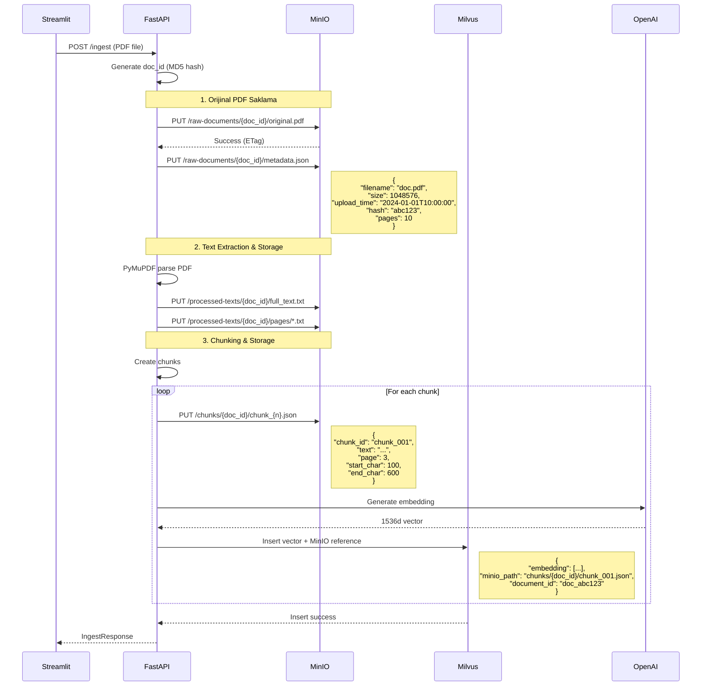
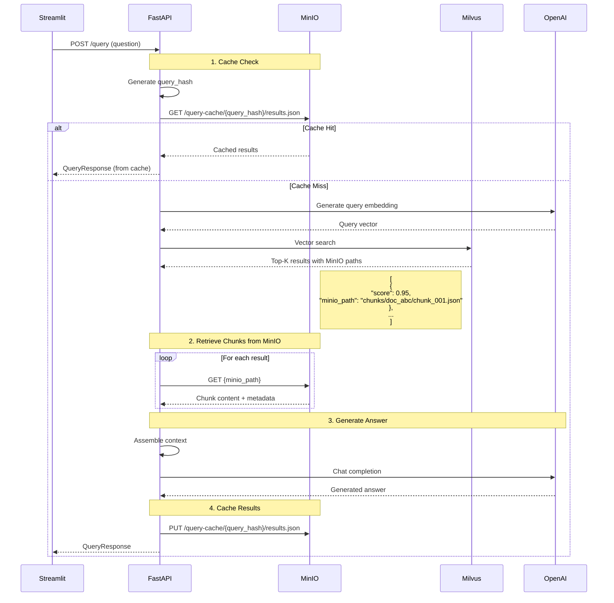
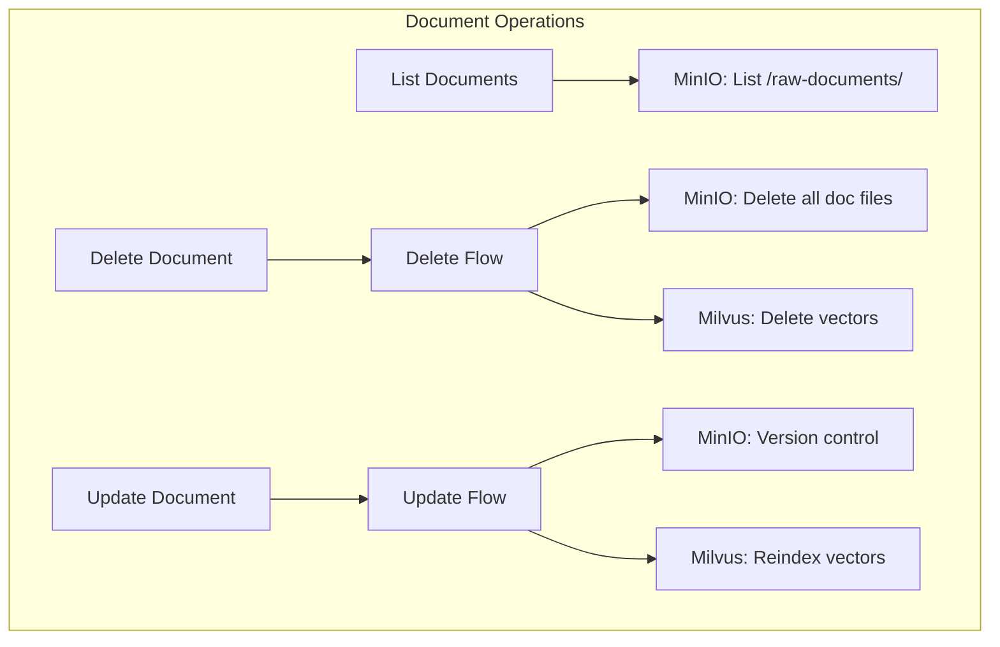

# MinIO Integration Design - İdeal Veri Akışı

## 🎯 Genel Bakış

MinIO, sistemin merkezi veri deposu olarak tüm PDF dokümanları, text chunk'ları, metadata ve processing artifact'lerini saklamalıdır. Milvus sadece vektör embedding'leri ve MinIO referanslarını tutmalıdır.

## 🏗️ MinIO Bucket Yapısı

```
minio/
├── raw-documents/           # Orijinal PDF dosyaları
│   ├── doc_abc123/
│   │   ├── original.pdf     # Orijinal PDF
│   │   └── metadata.json    # Doküman metadata
│   └── doc_xyz789/
│       ├── original.pdf
│       └── metadata.json
│
├── processed-texts/         # İşlenmiş text verileri
│   ├── doc_abc123/
│   │   ├── full_text.txt   # Tüm doküman metni
│   │   ├── pages/          # Sayfa bazlı metinler
│   │   │   ├── page_001.txt
│   │   │   ├── page_002.txt
│   │   │   └── ...
│   │   └── processing_log.json
│   └── doc_xyz789/
│       └── ...
│
├── chunks/                  # Text chunk'ları
│   ├── doc_abc123/
│   │   ├── chunk_0001.json # Chunk metni + metadata
│   │   ├── chunk_0002.json
│   │   └── ...
│   └── doc_xyz789/
│       └── ...
│
└── query-cache/            # Query sonuçları cache
    ├── query_hash_abc/
    │   ├── results.json
    │   └── timestamp.txt
    └── ...
```

## 📊 İdeal Veri Akışı

### 1️⃣ DOKÜMAN YÜKLEME (INGEST) AKIŞI



### 2️⃣ SORGULAMA (QUERY) AKIŞI



### 3️⃣ DOKÜMAN YÖNETİMİ



## 💾 MinIO API İletişim Detayları

### MinIO Client Başlatma
```python
from minio import Minio
from minio.error import S3Error

minio_client = Minio(
    "localhost:9000",
    access_key="minioadmin",
    secret_key="minioadmin",
    secure=False
)

# Bucket'ları oluştur
buckets = ["raw-documents", "processed-texts", "chunks", "query-cache"]
for bucket in buckets:
    if not minio_client.bucket_exists(bucket):
        minio_client.make_bucket(bucket)
```

### A) PDF Upload to MinIO

#### FastAPI → MinIO
```python
# Orijinal PDF'i sakla
pdf_path = f"{document_id}/original.pdf"
minio_client.put_object(
    bucket_name="raw-documents",
    object_name=pdf_path,
    data=BytesIO(pdf_data),
    length=len(pdf_data),
    content_type="application/pdf",
    metadata={
        "document_id": document_id,
        "upload_time": datetime.now().isoformat(),
        "original_name": file.filename
    }
)
```

#### MinIO → FastAPI Response
```python
{
    "etag": "9bb58f26192e4ba00f01e2e7b136bbd8",
    "version_id": "v1",
    "location": "/raw-documents/doc_abc123/original.pdf"
}
```

### B) Chunk Storage to MinIO

#### FastAPI → MinIO
```python
for i, chunk in enumerate(chunks):
    chunk_data = {
        "chunk_id": f"chunk_{document_id}_{i:04d}",
        "document_id": document_id,
        "document_title": document_title,
        "text": chunk.text,
        "page_number": chunk.page_number,
        "chunk_index": i,
        "start_position": chunk.start_pos,
        "end_position": chunk.end_pos,
        "created_at": datetime.now().isoformat()
    }
    
    chunk_path = f"{document_id}/chunk_{i:04d}.json"
    minio_client.put_object(
        bucket_name="chunks",
        object_name=chunk_path,
        data=BytesIO(json.dumps(chunk_data).encode()),
        length=len(json.dumps(chunk_data).encode()),
        content_type="application/json"
    )
```

### C) Chunk Retrieval from MinIO

#### FastAPI → MinIO
```python
# Query sonuçlarından chunk'ları al
chunks_content = []
for result in search_results:
    minio_path = result.entity.get('minio_path')  # "chunks/doc_abc/chunk_001.json"
    bucket, object_path = minio_path.split('/', 1)
    
    response = minio_client.get_object(bucket, object_path)
    chunk_data = json.loads(response.read())
    chunks_content.append(chunk_data)
```

### D) Query Cache Management

#### FastAPI → MinIO (Cache Write)
```python
query_hash = hashlib.md5(f"{question}_{top_k}_{document_id}".encode()).hexdigest()
cache_data = {
    "query": question,
    "timestamp": datetime.now().isoformat(),
    "answer": generated_answer,
    "sources": sources,
    "ttl": 3600  # 1 hour cache
}

cache_path = f"{query_hash}/results.json"
minio_client.put_object(
    bucket_name="query-cache",
    object_name=cache_path,
    data=BytesIO(json.dumps(cache_data).encode()),
    length=len(json.dumps(cache_data).encode()),
    content_type="application/json"
)
```

#### FastAPI → MinIO (Cache Read)
```python
try:
    response = minio_client.get_object("query-cache", f"{query_hash}/results.json")
    cache_data = json.loads(response.read())
    
    # TTL kontrolü
    cached_time = datetime.fromisoformat(cache_data['timestamp'])
    if (datetime.now() - cached_time).seconds < cache_data['ttl']:
        return cache_data  # Cache hit
except S3Error:
    pass  # Cache miss
```

### E) Document Listing from MinIO

#### FastAPI → MinIO
```python
# Tüm dokümanları listele
documents = []
objects = minio_client.list_objects("raw-documents", recursive=False)

for obj in objects:
    doc_id = obj.object_name.split('/')[0]
    
    # Metadata'yı al
    metadata_response = minio_client.get_object(
        "raw-documents", 
        f"{doc_id}/metadata.json"
    )
    metadata = json.loads(metadata_response.read())
    
    # Chunk sayısını al
    chunk_count = len(list(minio_client.list_objects(
        "chunks", 
        prefix=f"{doc_id}/",
        recursive=True
    )))
    
    documents.append({
        "document_id": doc_id,
        "title": metadata['title'],
        "chunks_count": chunk_count,
        "size": metadata['size'],
        "upload_time": metadata['upload_time']
    })
```

### F) Document Deletion from MinIO

#### FastAPI → MinIO
```python
def delete_document_from_minio(document_id: str):
    # Tüm bucket'lardan sil
    buckets_to_clean = [
        ("raw-documents", f"{document_id}/"),
        ("processed-texts", f"{document_id}/"),
        ("chunks", f"{document_id}/")
    ]
    
    for bucket, prefix in buckets_to_clean:
        objects = minio_client.list_objects(bucket, prefix=prefix, recursive=True)
        for obj in objects:
            minio_client.remove_object(bucket, obj.object_name)
    
    # Cache'i temizle (opsiyonel)
    cache_objects = minio_client.list_objects("query-cache", recursive=True)
    for obj in cache_objects:
        # Cache metadata'sını kontrol et ve ilgili cache'leri sil
        pass
```

## 🔄 Milvus'ta Saklanacak Veriler (Updated)

```python
# Milvus'ta sadece vektörler ve MinIO referansları
{
    "id": 123456,  # Auto-generated
    "embedding": [...],  # 1536d vector
    "document_id": "doc_abc123",
    "minio_path": "chunks/doc_abc123/chunk_0001.json",  # MinIO referansı
    "chunk_index": 0,
    "created_at": "2024-01-01T10:00:00"
}
```

## 📈 Performans Optimizasyonları

### 1. Presigned URLs
```python
# Büyük dosyalar için presigned URL
presigned_url = minio_client.presigned_get_object(
    "raw-documents",
    f"{document_id}/original.pdf",
    expires=timedelta(hours=1)
)
# URL'i Streamlit'e gönder, direkt download için
```

### 2. Multipart Upload
```python
# Büyük PDF'ler için multipart upload
if file_size > 5 * 1024 * 1024:  # 5MB üzeri
    minio_client.put_object(
        bucket_name="raw-documents",
        object_name=pdf_path,
        data=file_stream,
        length=-1,  # Unknown size, will use multipart
        part_size=10*1024*1024  # 10MB parts
    )
```

### 3. Object Versioning
```python
# Versioning'i etkinleştir
from minio.commonconfig import VersioningConfig

config = VersioningConfig(status="Enabled")
minio_client.set_bucket_versioning("raw-documents", config)
```

### 4. Lifecycle Policies
```python
# Query cache için otomatik temizleme
lifecycle_config = {
    "Rules": [{
        "ID": "delete-old-cache",
        "Status": "Enabled",
        "Expiration": {"Days": 7},
        "Filter": {"Prefix": "query-cache/"}
    }]
}
```

## 🔐 Güvenlik Önlemleri

### 1. Access Control
```python
# Bucket policy örneği
policy = {
    "Version": "2012-10-17",
    "Statement": [{
        "Effect": "Allow",
        "Principal": {"AWS": ["arn:aws:iam::account-id:user/rag-service"]},
        "Action": ["s3:GetObject", "s3:PutObject"],
        "Resource": ["arn:aws:s3:::chunks/*"]
    }]
}
```

### 2. Encryption
```python
# Server-side encryption
from minio.sse import SseCustomerKey

sse_key = SseCustomerKey(b"32_byte_encryption_key_here_xxx")
minio_client.put_object(..., sse=sse_key)
```

## 📊 MinIO Dashboard Monitoring

### Bucket Metrikleri
- **raw-documents**: Toplam PDF sayısı ve boyutu
- **chunks**: Chunk sayısı ve ortalama boyut
- **query-cache**: Cache hit/miss oranı
- **processed-texts**: İşlenmiş metin boyutu

### Monitoring Endpoints
```python
# MinIO health check
@app.get("/minio/health")
async def minio_health():
    try:
        # List buckets to test connection
        buckets = minio_client.list_buckets()
        
        # Get storage info
        stats = {}
        for bucket in ["raw-documents", "chunks", "processed-texts", "query-cache"]:
            objects = list(minio_client.list_objects(bucket, recursive=True))
            total_size = sum(obj.size for obj in objects)
            stats[bucket] = {
                "object_count": len(objects),
                "total_size_mb": total_size / (1024 * 1024)
            }
        
        return {
            "status": "healthy",
            "buckets": len(buckets),
            "statistics": stats
        }
    except Exception as e:
        raise HTTPException(status_code=503, detail=f"MinIO unavailable: {str(e)}")
```

## 🚀 Migration Strategy (Mevcut Sistemden)

### Phase 1: MinIO Setup
1. Docker'da MinIO'yu aktifleştir
2. Bucket'ları oluştur
3. Connection test

### Phase 2: Dual Write
1. Hem Milvus'a hem MinIO'ya yaz
2. Read'lerde MinIO'yu tercih et
3. Fallback olarak Milvus kullan

### Phase 3: Data Migration
1. Mevcut Milvus verilerini MinIO'ya taşı
2. Chunk'ları JSON olarak export et
3. MinIO'ya import et

### Phase 4: Cutover
1. Milvus'ta sadece vektör + referans sakla
2. Tüm text verilerini MinIO'dan oku
3. Eski text field'ları Milvus'tan kaldır

## 📝 Implementation Checklist

- [ ] MinIO client entegrasyonu (`app/storage.py` güncelle)
- [ ] Bucket yapısını oluştur
- [ ] PDF upload flow'u güncelle
- [ ] Chunk storage implementasyonu
- [ ] Query'de MinIO'dan chunk okuma
- [ ] Cache mekanizması
- [ ] Document management (list/delete)
- [ ] Versioning ve lifecycle policies
- [ ] Health check ve monitoring
- [ ] Migration script'leri
- [ ] Test coverage

## 💡 Avantajlar

1. **Scalability**: MinIO horizontal olarak ölçeklenebilir
2. **Cost Efficiency**: Vektör DB'de sadece embedding'ler
3. **Flexibility**: Farklı veri formatları saklanabilir
4. **Caching**: Query sonuçları cache'lenebilir
5. **Versioning**: Doküman versiyonları takip edilebilir
6. **Backup**: MinIO replication ile kolay backup
7. **S3 Compatible**: AWS S3'e kolay migration