# 🔍 QUERY PIPELINE - Kullanıcı Sorgusu İşleme ve Cevap Üretme Akışı

## 🎯 Genel Bakış

Query Pipeline, kullanıcının sorduğu soruyu alıp, ilgili doküman parçalarını bulup, kaynak göstererek akıllı cevaplar üreten end-to-end süreçtir. Bu pipeline semantik arama, reranking ve LLM-based cevap üretimi içerir.

## 🔄 Pipeline Akış Diyagramı

```mermaid
flowchart TD
    Start([Kullanıcı Soru Sorar]) --> Input[1. Query Input Validation]
    Input --> EmbedQuery[2. Generate Query Embedding]
    EmbedQuery --> VectorSearch[3. Vector Similarity Search]
    VectorSearch --> LoadChunks[4. Load Chunks from MinIO]
    LoadChunks --> Rerank{5. Reranking?}
    
    Rerank -->|Yes| RerankChunks[5a. Rerank with BGE Model]
    Rerank -->|No| PrepareContext[6. Prepare Context]
    RerankChunks --> PrepareContext
    
    PrepareContext --> GenerateLLM[7. LLM Response Generation]
    GenerateLLM --> FormatResponse[8. Format Response with Sources]
    FormatResponse --> Return[9. Return to User]
    Return --> End([End])

    style Start fill:#4ade80
    style End fill:#f87171
    style Rerank fill:#fbbf24
    style GenerateLLM fill:#60a5fa
```



## 🏗️ Sistem Mimarisi


## 📋 Detaylı Adım Açıklamaları

### ADIM 1: Query Input Validation
**Endpoint:** `POST /query`
**Component:** `streamlit_app.py` → `production_server.py`

```python
# Streamlit tarafı (streamlit_app.py:150-165)
def send_query(question: str):
    """Send query to backend API"""
    try:
        response = requests.post(
            f"{API_BASE_URL}/query",
            json={
                "question": question,
                "top_k": 5,  # Kaç chunk getirilecek
                "use_reranker": True  # Reranking kullanılsın mı
            },
            timeout=30
        )
        return response.json()
    except Exception as e:
        st.error(f"Query failed: {str(e)}")
```

**FastAPI Route Handler:**
```python
# production_server.py:200-210
@app.post("/query", response_model=QueryResponse)
async def query_documents(request: QueryRequest):
    start_time = datetime.datetime.now()
    
    # Input validation
    if not request.question or len(request.question.strip()) < 3:
        raise HTTPException(
            status_code=400,
            detail="Question must be at least 3 characters"
        )
    
    # Normalize parameters
    top_k = request.top_k or 5
    use_reranker = request.use_reranker or False
    
    logger.info(f"Processing query: {request.question[:50]}...")
```

**Request Model:**
```python
class QueryRequest(BaseModel):
    question: str
    top_k: Optional[int] = 5
    use_reranker: Optional[bool] = True
    filters: Optional[Dict] = None  # For metadata filtering
```

---

### ADIM 2: Generate Query Embedding
**İşlem:** Kullanıcı sorusunu vektöre çevirme
**Component:** `production_server.py:215-230` → OpenAI API

```python
# Generate embedding for the query
from openai import OpenAI
import numpy as np

client = OpenAI(api_key=os.getenv('OPENAI_API_KEY'))

# Step 1: Clean and prepare query
clean_query = request.question.strip()
clean_query = ' '.join(clean_query.split())  # Normalize whitespace

# Step 2: Generate embedding via OpenAI
try:
    embedding_response = client.embeddings.create(
        model='text-embedding-3-small',
        input=clean_query,
        encoding_format="float"
    )
    
    # Extract 1536-dimensional vector
    query_embedding = embedding_response.data[0].embedding
    query_vector = np.array(query_embedding, dtype=np.float32)
    
    logger.info(f"Generated query embedding: dim={len(query_vector)}")
    
except Exception as e:
    logger.error(f"Embedding generation failed: {e}")
    raise HTTPException(
        status_code=500,
        detail="Failed to generate query embedding"
    )
```

**Embedding Details:**
```python
{
    "model": "text-embedding-3-small",
    "dimensions": 1536,
    "input_tokens": 15,  # Örnek
    "processing_time": 0.08  # seconds
}
```

---

### ADIM 3: Vector Similarity Search in Milvus
**İşlem:** En benzer chunk'ları bulma
**Component:** `production_server.py:235-270` → Milvus

```python
from pymilvus import connections, Collection
import json

# Connect to Milvus
connections.connect('default', host='localhost', port='19530')
collection = Collection('rag_production_v1')

# Ensure collection is loaded
collection.load()

# Search parameters
search_params = {
    "metric_type": "COSINE",  # Cosine similarity
    "params": {
        "nprobe": 128,  # Number of clusters to search
        "ef": 256  # Search accuracy parameter
    }
}

# Execute vector search
search_results = collection.search(
    data=[query_vector.tolist()],  # Query vector
    anns_field="embedding",  # Vector field name
    param=search_params,
    limit=top_k * 2,  # Get extra for reranking
    output_fields=[
        "chunk_id",
        "document_id", 
        "document_title",
        "minio_path",
        "page_num",
        "chunk_index"
    ]
)

# Process search results
chunks_data = []
for hits in search_results:
    for hit in hits:
        chunk_info = {
            "chunk_id": hit.entity.get("chunk_id"),
            "document_id": hit.entity.get("document_id"),
            "document_title": hit.entity.get("document_title"),
            "minio_path": hit.entity.get("minio_path"),
            "page_num": hit.entity.get("page_num"),
            "score": hit.score,  # Cosine similarity score [0, 1]
            "distance": hit.distance  # Distance metric
        }
        chunks_data.append(chunk_info)

logger.info(f"Found {len(chunks_data)} similar chunks")
```

**Milvus Search Metrics:**
```python
{
    "search_latency": 0.015,  # seconds
    "chunks_retrieved": 10,
    "similarity_range": [0.75, 0.95],  # Min-max scores
    "index_type": "IVF_FLAT",
    "metric": "COSINE"
}
```

---

### ADIM 4: Load Chunk Texts from MinIO
**İşlem:** Chunk metinlerini MinIO'dan yükleme
**Component:** `production_server.py:275-310` → MinIO

```python
from minio import Minio
import json
from io import BytesIO

# MinIO client
minio_client = Minio(
    "localhost:9000",
    access_key="minioadmin",
    secret_key="minioadmin",
    secure=False
)

# Load chunk texts from MinIO
for chunk in chunks_data:
    try:
        # Get chunk JSON from MinIO
        minio_path = chunk["minio_path"]
        
        # Fetch object
        response = minio_client.get_object(
            bucket_name="chunks",
            object_name=minio_path
        )
        
        # Parse JSON content
        chunk_json = json.loads(response.read().decode('utf-8'))
        
        # Add text to chunk data
        chunk["text"] = chunk_json["text"]
        chunk["metadata"] = chunk_json.get("metadata", {})
        
        # Close MinIO response
        response.close()
        response.release_conn()
        
    except Exception as e:
        logger.error(f"Failed to load chunk {minio_path}: {e}")
        chunk["text"] = "[Chunk loading failed]"

logger.info(f"Loaded texts for {len(chunks_data)} chunks")
```

**MinIO Fetch Pattern:**
```python
# Parallel fetching for performance
from concurrent.futures import ThreadPoolExecutor

def fetch_chunk(minio_path):
    # MinIO fetch logic
    pass

with ThreadPoolExecutor(max_workers=5) as executor:
    futures = [executor.submit(fetch_chunk, c["minio_path"]) for c in chunks_data]
    results = [f.result() for f in futures]
```

---

### ADIM 5: Reranking (Optional)
**İşlem:** BGE reranker ile chunk'ları yeniden sıralama
**Component:** `production_server.py:315-350` → BGE Reranker

```python
from transformers import AutoTokenizer, AutoModelForSequenceClassification
import torch

if use_reranker and len(chunks_data) > 1:
    # Load BGE reranker model
    model_name = "BAAI/bge-reranker-v2-m3"
    tokenizer = AutoTokenizer.from_pretrained(model_name)
    model = AutoModelForSequenceClassification.from_pretrained(model_name)
    model.eval()
    
    # Prepare pairs for reranking
    pairs = []
    for chunk in chunks_data:
        pairs.append([clean_query, chunk["text"]])
    
    # Tokenize and get scores
    with torch.no_grad():
        inputs = tokenizer(
            pairs,
            padding=True,
            truncation=True,
            max_length=512,
            return_tensors='pt'
        )
        
        scores = model(**inputs).logits.squeeze(-1)
        scores = torch.nn.functional.sigmoid(scores).numpy()
    
    # Add reranking scores
    for i, chunk in enumerate(chunks_data):
        chunk["rerank_score"] = float(scores[i])
        chunk["original_rank"] = i + 1
    
    # Sort by reranking score
    chunks_data = sorted(
        chunks_data, 
        key=lambda x: x["rerank_score"], 
        reverse=True
    )[:top_k]
    
    logger.info(f"Reranked to top {len(chunks_data)} chunks")
```

**Reranking Impact:**
```python
{
    "before_reranking": {
        "top_chunk_score": 0.85,
        "order": [1, 2, 3, 4, 5]
    },
    "after_reranking": {
        "top_chunk_score": 0.92,
        "order": [3, 1, 5, 2, 4],  # Reordered
        "improvement": "+7%"
    }
}
```

---

### ADIM 6: Prepare Context for LLM
**İşlem:** LLM için context hazırlama
**Component:** `production_server.py:355-380`

```python
# Build context from retrieved chunks
context_parts = []
source_references = []

for i, chunk in enumerate(chunks_data, 1):
    # Format chunk for context
    context_part = f"""
[Kaynak {i}]
Doküman: {chunk['document_title']}
Sayfa: {chunk['page_num']}
İçerik: {chunk['text']}
---
"""
    context_parts.append(context_part)
    
    # Prepare source reference
    source_ref = {
        "index": i,
        "document_title": chunk['document_title'],
        "page_number": chunk['page_num'],
        "score": chunk.get('rerank_score', chunk['score']),
        "text_preview": chunk['text'][:200] + "..."
    }
    source_references.append(source_ref)

# Combine context
full_context = "\n".join(context_parts)

# Calculate token usage
estimated_tokens = len(full_context.split()) * 1.3  # Rough estimate

logger.info(f"Context prepared: {len(context_parts)} sources, ~{estimated_tokens} tokens")
```

**Context Structure:**
```
Total Context: 2500 tokens
├── System Prompt: 150 tokens
├── User Question: 50 tokens
├── Retrieved Chunks: 2000 tokens (5 x 400)
└── Format Instructions: 300 tokens
```

---

### ADIM 7: LLM Response Generation
**İşlem:** GPT-4 ile cevap üretme
**Component:** `production_server.py:385-420` → OpenAI GPT-4

```python
from openai import OpenAI

# System prompt for RAG
system_prompt = """Sen yardımcı bir asistansın. Sana verilen kaynaklara dayanarak soruları cevaplıyorsun.

KURALLAR:
1. SADECE verilen kaynaklardaki bilgileri kullan
2. Her bilgi için kaynak numarasını belirt [Kaynak X]
3. Kaynaklarda olmayan bilgi için "Verilen kaynaklarda bu bilgi bulunmamaktadır" de
4. Cevabını Türkçe ver
5. Net, açık ve yapılandırılmış cevaplar ver
"""

# Build messages
messages = [
    {"role": "system", "content": system_prompt},
    {"role": "user", "content": f"""
Soru: {clean_query}

Kaynaklar:
{full_context}

Lütfen yukarıdaki kaynaklara dayanarak soruyu cevapla.
"""}
]

# Generate response with GPT-4
try:
    llm_response = client.chat.completions.create(
        model="gpt-4o-mini",
        messages=messages,
        temperature=0.3,  # Lower for more factual responses
        max_tokens=1000,
        top_p=0.9,
        frequency_penalty=0.0,
        presence_penalty=0.0
    )
    
    answer = llm_response.choices[0].message.content
    
    # Extract usage statistics
    usage_stats = {
        "prompt_tokens": llm_response.usage.prompt_tokens,
        "completion_tokens": llm_response.usage.completion_tokens,
        "total_tokens": llm_response.usage.total_tokens,
        "model": "gpt-4o-mini"
    }
    
    logger.info(f"LLM response generated: {usage_stats['total_tokens']} tokens")
    
except Exception as e:
    logger.error(f"LLM generation failed: {e}")
    answer = "Üzgünüm, cevap üretilirken bir hata oluştu."
```

**LLM Parameters Explained:**
```python
{
    "temperature": 0.3,  # Creativity vs Factuality (0=factual, 1=creative)
    "max_tokens": 1000,  # Maximum response length
    "top_p": 0.9,  # Nucleus sampling (diversity)
    "model": "gpt-4o-mini",  # Fast, cost-effective model
    "response_time": 1.5  # seconds average
}
```

---

### ADIM 8: Format Response with Sources
**İşlem:** Cevabı kaynaklarla formatlama
**Component:** `production_server.py:425-450`

```python
# Calculate processing time
processing_time = (datetime.datetime.now() - start_time).total_seconds()

# Build final response
response = QueryResponse(
    answer=answer,
    sources=source_references,
    processing_time=processing_time,
    metadata={
        "chunks_retrieved": len(chunks_data),
        "reranking_used": use_reranker,
        "tokens_used": usage_stats["total_tokens"],
        "model_used": "gpt-4o-mini",
        "embedding_model": "text-embedding-3-small",
        "search_latency": search_latency,
        "llm_latency": llm_latency
    }
)

logger.info(f"Query completed in {processing_time:.2f}s")

return response
```

**Response Structure:**
```json
{
    "answer": "Posta gezici personeline verilecek harcırah miktarı, görev yapılan bölgeye ve mesafeye göre belirlenir. [Kaynak 1] Madde 5'e göre, il içi görevlerde günlük 150 TL, il dışı görevlerde ise 250 TL harcırah ödenir. [Kaynak 2]",
    "sources": [
        {
            "index": 1,
            "document_title": "Posta Gezici Personeli Harcırah Tüzüğü",
            "page_number": 3,
            "score": 0.92,
            "text_preview": "MADDE 5 - Harcırah miktarları..."
        },
        {
            "index": 2,
            "document_title": "Posta Gezici Personeli Harcırah Tüzüğü",
            "page_number": 7,
            "score": 0.88,
            "text_preview": "İl dışı görevlendirmelerde..."
        }
    ],
    "processing_time": 2.3,
    "metadata": {
        "chunks_retrieved": 5,
        "reranking_used": true,
        "tokens_used": 3250,
        "model_used": "gpt-4o-mini"
    }
}
```

---

### ADIM 9: Return Response to User
**İşlem:** Streamlit UI'da gösterme
**Component:** `streamlit_app.py:170-200`

```python
# Display in Streamlit chat interface
def display_response(response):
    """Display the query response in chat UI"""
    
    # Add to chat history
    st.session_state.messages.append({
        "role": "assistant",
        "content": response["answer"],
        "sources": response.get("sources", [])
    })
    
    # Display the answer
    with st.chat_message("assistant"):
        st.markdown(response["answer"])
        
        # Display sources if available
        if response.get("sources"):
            st.markdown("### 📚 Kaynaklar")
            for source in response["sources"]:
                with st.expander(
                    f"Kaynak {source['index']}: {source['document_title']} "
                    f"(Sayfa {source['page_number']}, Skor: {source['score']:.2f})"
                ):
                    st.text(source["text_preview"])
        
        # Show processing stats
        with st.expander("📊 İşlem Detayları"):
            st.json({
                "İşlem Süresi": f"{response['processing_time']:.2f} saniye",
                "Taranan Chunk": response['metadata']['chunks_retrieved'],
                "Kullanılan Token": response['metadata']['tokens_used'],
                "Model": response['metadata']['model_used']
            })
```

---

## 🔍 Error Handling & Edge Cases

### Common Error Scenarios

```python
# 1. No relevant chunks found
if not chunks_data or all(c["score"] < 0.5 for c in chunks_data):
    return QueryResponse(
        answer="Üzgünüm, sorunuzla ilgili kaynaklarda bilgi bulunamadı.",
        sources=[],
        processing_time=processing_time,
        metadata={"status": "no_relevant_content"}
    )

# 2. OpenAI API rate limit
except RateLimitError as e:
    logger.warning(f"Rate limit hit: {e}")
    # Implement exponential backoff
    await asyncio.sleep(2 ** retry_count)
    # Retry or fallback to cached response

# 3. Milvus connection failure
except MilvusException as e:
    logger.error(f"Milvus search failed: {e}")
    # Fallback to MinIO full-text search
    return fallback_text_search(query)

# 4. Token limit exceeded
if estimated_tokens > 3500:
    # Truncate context to fit
    chunks_data = chunks_data[:3]  # Use only top 3 chunks
    logger.warning("Context truncated due to token limit")
```

---

## 📊 Performance Metrics & Optimization

### Typical Query Processing Times

| Stage | Time (avg) | Details | Optimization |
|-------|------------|---------|--------------|
| Input Validation | 0.01s | Basic checks | Cached |
| Query Embedding | 0.08s | OpenAI API | Batch queries |
| Vector Search | 0.02s | Milvus search | Index optimization |
| Load Chunks | 0.15s | MinIO fetch | Connection pooling |
| Reranking | 0.30s | BGE model | GPU acceleration |
| LLM Generation | 1.50s | GPT-4 API | Model selection |
| Response Format | 0.01s | JSON building | - |
| **Total** | **~2.07s** | End-to-end | - |

### Optimization Strategies

```python
# 1. Caching frequently asked questions
from functools import lru_cache

@lru_cache(maxsize=100)
def get_cached_embedding(query: str):
    # Cache query embeddings
    pass

# 2. Parallel processing
async def parallel_chunk_loading(chunk_paths):
    tasks = [load_chunk_async(path) for path in chunk_paths]
    return await asyncio.gather(*tasks)

# 3. Connection pooling
minio_pool = MinioConnectionPool(max_connections=10)
milvus_pool = MilvusConnectionPool(max_connections=5)

# 4. Smart chunking for context
def optimize_context(chunks, max_tokens=3000):
    # Intelligently select most relevant parts
    optimized = []
    token_count = 0
    for chunk in chunks:
        chunk_tokens = len(chunk["text"].split()) * 1.3
        if token_count + chunk_tokens < max_tokens:
            optimized.append(chunk)
            token_count += chunk_tokens
    return optimized
```

---

## 🚀 Advanced Features

### 1. Hybrid Search (Vector + Keyword)
```python
# Combine vector similarity with BM25 keyword search
vector_results = milvus_search(query_embedding)
keyword_results = elasticsearch_search(query_text)
hybrid_results = merge_and_rerank(vector_results, keyword_results)
```

### 2. Query Expansion
```python
# Expand user query with synonyms and related terms
expanded_query = query_expander.expand(original_query)
# Example: "maaş" → "maaş, ücret, aylık, özlük hakları"
```

### 3. Multi-turn Conversation
```python
# Maintain conversation context
conversation_history = st.session_state.get("history", [])
contextualized_query = build_context_aware_query(
    current_query, 
    conversation_history
)
```

### 4. Streaming Responses
```python
# Stream LLM responses for better UX
async def stream_response():
    async for chunk in llm.astream(messages):
        yield chunk.content
```

---

## 📌 Summary & Key Takeaways

### Query Pipeline Özeti


### Kritik Başarı Faktörleri

1. **Hız Optimizasyonu**
   - Query embedding caching
   - Parallel chunk loading
   - Connection pooling
   - Smart context truncation

2. **Doğruluk İyileştirmeleri**
   - Semantic search (vector)
   - Reranking with BGE
   - Source attribution
   - Context relevance filtering

3. **Kullanıcı Deneyimi**
   - <2.5s response time
   - Clear source citations
   - Structured answers
   - Error recovery

4. **Sistem Güvenilirliği**
   - Fallback mechanisms
   - Rate limit handling
   - Connection retry logic
   - Graceful degradation

### Data Flow Summary

```
❓ User Question (15 tokens)
    ↓ Embed
🔢 Query Vector (1536d)
    ↓ Search
📚 10 Chunks Retrieved
    ↓ Rerank
📖 5 Best Chunks
    ↓ Context
📝 2500 Token Context
    ↓ LLM
💬 Answer (500 tokens)
    ↓
✅ Response with Sources
```

### Performance Targets

- ⚡ **Response Time**: <2.5 seconds
- 🎯 **Accuracy**: >90% relevant results
- 📊 **Token Efficiency**: <4000 tokens/query
- 🔄 **Throughput**: 100+ queries/minute
- 💾 **Cache Hit Rate**: >30%

Bu pipeline sayesinde:
- ✅ Hızlı ve doğru cevaplar üretilir
- ✅ Her cevap kaynak gösterir
- ✅ Context-aware responses
- ✅ Scalable architecture
- ✅ Production-ready error handling