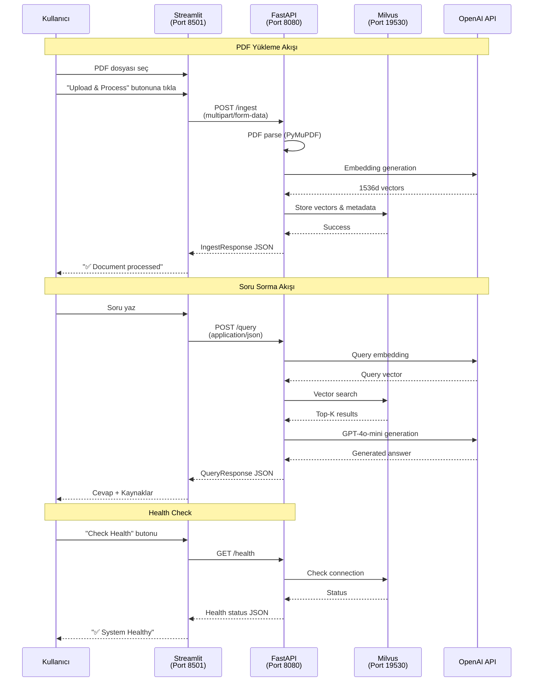

# Streamlit İletişim Akışı - Detaylı Analiz

## 🎯 Genel Bakış

Streamlit uygulaması (`streamlit_app.py`) **sadece FastAPI backend** (`production_server.py` veya `app/server.py`) ile HTTP üzerinden iletişim kurar. Port 8501'de çalışan Streamlit, port 8080'deki FastAPI'ye REST API çağrıları yapar.

## 🔗 İletişim Kurduğu Servis

**TEK İLETİŞİM NOKTASI: FastAPI Backend (http://localhost:8080)**

```python
API_BASE_URL = os.getenv("API_BASE_URL", "http://localhost:8080")
```

## 📡 İletişim Endpoint'leri ve Veri Akışı

### 1️⃣ Health Check - Sistem Durumu Kontrolü

#### Request (Streamlit → FastAPI)
```http
GET http://localhost:8080/health
Headers: None
Body: None
```

#### Response (FastAPI → Streamlit)
```json
{
    "status": "healthy",
    "timestamp": "2024-01-01T10:00:00",
    "services": {
        "milvus": "connected",
        "collection": "rag_production_v1",
        "entities": 1234
    },
    "version": "2.0.0"
}
```

#### Streamlit'te Kullanımı
```python
# streamlit_app.py:98-108
response = requests.get(f"{API_BASE_URL}/health")
if response.status_code == 200:
    health_data = response.json()
    st.success("✅ System Healthy")
    st.json(health_data)
```

---

### 2️⃣ Document Ingestion - PDF Yükleme

#### Request (Streamlit → FastAPI)
```http
POST http://localhost:8080/ingest
Content-Type: multipart/form-data
Body: 
  - file: [PDF binary data]
    - filename: "document.pdf"
    - content-type: "application/pdf"
```

#### Python Kodu
```python
# streamlit_app.py:69-73
files = {
    "file": (
        uploaded_file.name,           # Dosya adı
        uploaded_file.getvalue(),      # PDF binary içeriği
        "application/pdf"              # MIME type
    )
}
response = requests.post(f"{API_BASE_URL}/ingest", files=files)
```

#### Response (FastAPI → Streamlit)
```json
{
    "success": true,
    "document_id": "doc_a1b2c3d4e5f6g7h8",
    "document_title": "Örnek Doküman",
    "chunks_created": 25,
    "processing_time": 3.5,
    "file_hash": "a1b2c3d4e5f6g7h8i9j0",
    "message": "Document successfully ingested with 25 chunks"
}
```

#### Hata Durumu Response
```json
{
    "success": false,
    "document_id": "",
    "document_title": "",
    "chunks_created": 0,
    "processing_time": 0.5,
    "file_hash": "",
    "message": "Document already exists in database"
}
```

---

### 3️⃣ Query - Soru Sorma

#### Request (Streamlit → FastAPI)
```http
POST http://localhost:8080/query
Content-Type: application/json
Body:
{
    "question": "Bu dokümanda ne anlatılıyor?",
    "top_k": 5,
    "document_id": null  // Optional: specific document filter
}
```

#### Python Kodu
```python
# streamlit_app.py:179-183
query_data = {
    "question": last_message["content"],
    "top_k": 5
}
response = requests.post(f"{API_BASE_URL}/query", json=query_data)
```

#### Response (FastAPI → Streamlit)
```json
{
    "answer": "Bu dokümanda posta gezici personeline verilecek harcırah ile ilgili düzenlemeler anlatılmaktadır. [Kaynak 1] belgesine göre...",
    "sources": [
        {
            "rank": 1,
            "score": 0.95,
            "document_id": "doc_a1b2c3d4e5f6g7h8",
            "document_title": "POSTA GEZİCİ PERSONELİ HARCIRAH TÜZÜĞÜ",
            "page_number": 3,
            "text_preview": "Posta gezici personeline verilecek harcırah miktarları...",
            "created_at": "2024-01-01T10:00:00"
        },
        {
            "rank": 2,
            "score": 0.89,
            "document_id": "doc_a1b2c3d4e5f6g7h8",
            "document_title": "POSTA GEZİCİ PERSONELİ HARCIRAH TÜZÜĞÜ",
            "page_number": 5,
            "text_preview": "Harcırah hesaplama yöntemleri...",
            "created_at": "2024-01-01T10:00:00"
        }
    ],
    "processing_time": 1.2,
    "model_used": "gpt-4o-mini"
}
```

---

## 📊 Veri Akış Diyagramı



## 🔄 Session State Yönetimi

Streamlit kendi içinde şu verileri tutar:

```python
# streamlit_app.py:42-46
st.session_state.messages = []        # Chat mesaj geçmişi
st.session_state.uploaded_files = []  # Yüklenen dosya listesi
```

### Message Formatı
```python
{
    "role": "user" | "bot",
    "content": "Mesaj içeriği",
    "timestamp": "10:30:45",
    "sources": [...]  # Sadece bot mesajlarında
}
```

## 🚫 Streamlit'in İletişim KURMADIĞI Servisler

Streamlit **direkt olarak** şu servislerle iletişim **KURMAZ**:

- ❌ **Milvus** (Vector DB) - Sadece FastAPI üzerinden
- ❌ **MinIO** (Object Storage) - Sadece FastAPI üzerinden  
- ❌ **OpenAI API** - Sadece FastAPI üzerinden
- ❌ **ETCD** - Sadece FastAPI üzerinden
- ❌ **Attu** (Milvus GUI) - Hiçbir iletişim yok

## 🔐 Güvenlik ve Yetkilendirme

### Mevcut Durum
- **Authentication**: YOK
- **API Key**: YOK (OpenAI key backend'de)
- **CORS**: Backend'de tüm origin'lere açık
- **Rate Limiting**: YOK
- **Input Validation**: Minimal (sadece PDF kontrolü)

### Docker Network İletişimi
```yaml
# docker-compose.yml
streamlit:
  environment:
    - API_BASE_URL=http://app:8080  # Docker network içinde
```

## 📈 İletişim Metrikleri

| Endpoint | Method | Ortalama Response Time | Payload Boyutu |
|----------|--------|----------------------|----------------|
| /health | GET | ~50ms | ~200 bytes |
| /ingest | POST | 2-5s | 1-50 MB (PDF) |
| /query | POST | 1-2s | ~2-5 KB |

## 🔍 Error Handling

### Connection Error
```python
except Exception as e:
    st.error(f"❌ Connection error: {str(e)}")
```

### API Error Response
```python
if response.status_code != 200:
    st.error(f"❌ Error: {response.text}")
```

## 💡 Önemli Notlar

1. **Tek Yönlü İletişim**: Streamlit sadece request gönderir, FastAPI'den response alır
2. **Stateless**: Her request bağımsız, session backend'de tutulmaz
3. **Synchronous**: Tüm API çağrıları senkron (WebSocket yok)
4. **No Streaming**: Response'lar tek seferde gelir (chunk yok)
5. **File Size Limit**: PDF boyutu Streamlit ve FastAPI limitlerine bağlı

## 🛠️ Debug İpuçları

### Request İzleme
```python
# Debug için request detaylarını loglama
import logging
logging.basicConfig(level=logging.DEBUG)

# Request öncesi
print(f"Sending request to: {API_BASE_URL}/query")
print(f"Payload: {query_data}")

# Response sonrası
print(f"Status: {response.status_code}")
print(f"Response: {response.json()}")
```

### Network İzleme
```bash
# Docker logs
docker compose logs -f streamlit
docker compose logs -f app

# Network traffic
tcpdump -i lo0 port 8080 -A
```

## 📦 Dependency Chain

```
Streamlit (8501)
    ↓ HTTP Requests (requests library)
FastAPI (8080)
    ↓ gRPC
Milvus (19530)
    ↓ Storage
MinIO (9000) & ETCD (2379)
```

Streamlit sadece FastAPI ile konuşur, diğer tüm servislerle olan iletişim FastAPI üzerinden gerçekleşir!